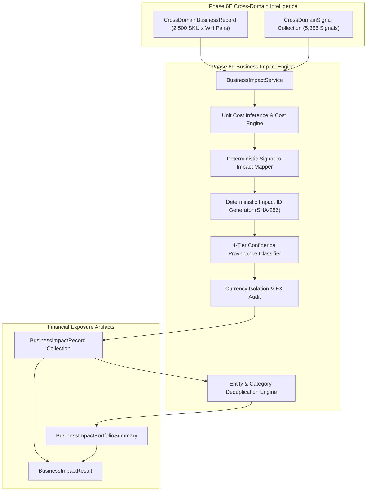

# Business Impact & Opportunity Quantification (Phase 6F)

> [!IMPORTANT]
> **Descriptive Measurement Boundary Disclaimer**<br>
> *This module quantifies observed and estimated financial and operational exposures for cross-domain signals. It measures **"How financially significant is the observed situation?"** It strictly does **NOT** answer **"What should the business do?"** It makes no business recommendations, initiates no automated actions, asserts no causal links, and promises no guaranteed savings or return on investment.*

---

## 1. Module Overview & Executive Objective

Business Impact & Opportunity Quantification (Phase 6F) is the definitive financial valuation layer of the eRetail AI Intelligence platform. While Phase 6E identifies descriptive co-occurring signals across commercial, operational, and inventory domains, Phase 6F converts those qualitative and threshold-based signals into **traceable, auditable financial and capital exposure figures**.

### Core Questions Answered:
1. **Financial Significance**: What is the total dollar valuation of stock tied up in slow-moving or low-margin inventory?
2. **Revenue at Risk**: What observed sales volume or gross margin coincides with critically depleted inventory positions?
3. **Return Exposure**: How much realized revenue and margin is eroded by observed product returns?
4. **Replenishment Capital Requirements**: What is the total capital expenditure required to fund proposed purchase orders under active reorder triggers?
5. **Double-Counting Control**: What is the true deduplicated capital exposure when multiple signals flag the same physical inventory?

---

## 2. Descriptive Measurement Boundary (Non-Causal & Non-Prescriptive Mandate)

Phase 6F strictly enforces the non-prescriptive, non-causal mandate:
- **No Optimization or Autonomous Actions**: The module outputs analytical values; it does not issue purchase orders, adjust prices, or rebalance inventory.
- **No Causal Inferences**: The engine states that an inventory valuation is *associated with* a stockout or demand velocity, never that low stock *caused* a lost sale.
- **No Speculative Loss Claims**: Unless supported by a calibrated upstream model, lost demand is not monetized via naive formulas (e.g. `stockout_days * daily_sales`).
- **Opportunity Proxy Semantics**: Any metric labeled `opportunity_proxy_value` represents a neutral, measurable financial parameter (e.g. current inventory capital valuation or observed sales volume), **never** guaranteed cost savings or profit upside.

---

## 3. Architecture & System Flow

Phase 6F operates downstream of Phase 6E, consuming `CrossDomainSignal` collections and `CrossDomainBusinessRecord` snapshots to generate auditable `BusinessImpactRecord` structures.



---

## 4. Signal-to-Impact Mapping Matrix

Each cross-domain signal is mapped deterministically to a specific impact category, exposure type, and calculation methodology:

| Signal Type | Impact Category | Impact Type | Primary Exposure Metric | Confidence Tier |
| :--- | :--- | :--- | :--- | :--- |
| `HIGH_REVENUE_LOW_STOCK` | `REVENUE` | `REVENUE_EXPOSURE` | Observed Net Revenue ($) | `DIRECT_OBSERVED` |
| `HIGH_MARGIN_LOW_STOCK` | `MARGIN` | `MARGIN_EXPOSURE` | Observed Gross Margin ($) | `DIRECT_OBSERVED` |
| `HIGH_REVENUE_STOCKOUT_EXPOSURE` | `STOCKOUT` | `STOCKOUT_REVENUE_EXPOSURE` | Observed Net Revenue / Lost Sales | `DIRECT_OBSERVED` / `ESTIMATED` |
| `LOW_MARGIN_HIGH_INVENTORY` | `INVENTORY` | `INVENTORY_CAPITAL_EXPOSURE` | Inventory Capital Valuation ($) | `DIRECT_OBSERVED` |
| `HIGH_INVENTORY_LOW_DEMAND` | `INVENTORY` | `SLOW_MOVING_INVENTORY_EXPOSURE`| Inventory Capital Valuation ($) | `DIRECT_OBSERVED` |
| `HIGH_VALUE_INVENTORY` | `INVENTORY` | `HIGH_VALUE_INVENTORY_EXPOSURE` | Inventory Capital Valuation ($) | `DIRECT_OBSERVED` |
| `LOW_REVENUE_HIGH_INVENTORY` | `INVENTORY` | `INVENTORY_CAPITAL_EXPOSURE` | Inventory Capital Valuation ($) | `DIRECT_OBSERVED` |
| `HIGH_RETURN_HIGH_REVENUE` | `RETURNS` | `RETURN_REVENUE_EXPOSURE` | Estimated Return Revenue ($) | `ESTIMATED` |
| `HIGH_RETURN_LOW_MARGIN` | `RETURNS` | `RETURN_MARGIN_EXPOSURE` | Estimated Return Margin ($) | `ESTIMATED` |
| `RETURN_ANOMALY_HIGH_VALUE_SKU` | `RETURNS` | `RETURN_REVENUE_EXPOSURE` | Model Expected Return Exposure ($) | `MODEL_BASED` / `DIRECT_OBSERVED` |
| `HIGH_REVENUE_REPLENISHMENT_TRIGGER`| `REPLENISHMENT` | `REPLENISHMENT_FINANCIAL_EXPOSURE`| Proposed Purchase Value ($) | `ESTIMATED` |
| `FORECASTED_DEMAND_ABOVE_AVAILABLE_STOCK`| `FORECAST` | `FORECAST_COVERAGE_EXPOSURE`| Unmonetized Physical Unit Gap | `ESTIMATED` (None $) |
| `FORECAST_UNAVAILABLE` | `FORECAST` | `FORECAST_COVERAGE_EXPOSURE`| None (Audit Only) | `INSUFFICIENT_DATA` |

---

## 5. Quantification Methodologies

The engine enforces a rigorous 4-tier confidence taxonomy based on methodological provenance:

### 1. `DIRECT_OBSERVED`
- Directly extracted from verified historical transactions, ledger records, or physical inventory snapshots.
- No behavioral assumptions, elasticity parameters, or predictive adjustments.
- *Examples*: Actual realized net revenue, observed inventory capital valuation (`on_hand * unit_cost`).

### 2. `ESTIMATED`
- Derived through an explicit, auditable, deterministic formula combining observed base metrics.
- All formula inputs are preserved in `calculation_inputs`.
- *Examples*:
  - Return revenue exposure: $\text{Return Rate} \times \text{Net Revenue}$
  - Return margin exposure: $\text{Return Rate} \times \text{Gross Margin}$
  - Proposed purchase valuation: $\text{Recommended Order Quantity (ROQ)} \times \text{Unit Cost}$

### 3. `MODEL_BASED`
- Generated by an upstream statistical or machine learning model (e.g. Phase 5C calibrated return risk model or Phase 2 lost-demand estimation).
- Explicitly flagged as model-dependent and subject to model error bounds.

### 4. `INSUFFICIENT_DATA`
- Underlying data components are missing, partial, or unverified.
- `exposure_value` is set strictly to `None` (never assumed 0.0) to prevent speculative estimates.
- *Examples*: Replenishment triggers where unit acquisition cost is unknown, or entities lacking demand forecasts.

---

## 6. Double-Counting Protection & Deduplication Framework

A critical requirement in financial exposure measurement is distinguishing **true overlapping physical capital exposure** from **distinct economic exposure dimensions**.

### 1. Physical Capital Overlap (Inventory Dimension)
Physical inventory on hand at a specific facility `(sku_id, warehouse_id)` represents a fixed monetary valuation ($\text{current\_on\_hand} \times \text{unit\_cost}$). Multiple signals may evaluate this identical physical inventory from different analytical viewpoints:
- `HIGH_VALUE_INVENTORY`
- `HIGH_INVENTORY_LOW_DEMAND`
- `LOW_MARGIN_HIGH_INVENTORY`
- `LOW_REVENUE_HIGH_INVENTORY`

Summing these signals naively triples or quadruples the apparent capital tied up in the warehouse. Phase 6F computes:
$$\text{Deduplicated Physical Capital Exposure} = \sum_{(\text{sku}, \text{wh})} \max_{s \in \text{InventorySignals}(\text{sku}, \text{wh})} \text{exposure\_value}(s)$$

On the canonical dataset, this resolves **\$20,993,498.48 (63.6%)** of overlapping inventory signal exposure, reducing gross inventory exposure from **\$32,984,505.67** to **\$11,991,007.19**.

### 2. Separation of Distinct Economic Exposure Dimensions
An enterprise entity (SKU × Warehouse) can legitimately experience multiple concurrent, non-overlapping economic exposures:
- **`INVENTORY_CAPITAL_EXPOSURE`**: Working capital locked in physical warehouse stock.
- **`REVENUE_EXPOSURE`**: Top-line sales volume coinciding with depleted stock.
- **`MARGIN_EXPOSURE`**: Gross profit margin at risk.
- **`RETURN_REVENUE_EXPOSURE`**: Top-line revenue reversed by product returns.
- **`RETURN_MARGIN_EXPOSURE`**: Gross profit permanently eroded by product returns.
- **`REPLENISHMENT_FINANCIAL_EXPOSURE`**: Working capital required for proposed purchase orders.

These represent **different economic dimensions**, not duplicate representations of the same dollar. They must **never** be silently collapsed into an arbitrary cross-category maximum.

### 3. Terminology & Deduplication Metrics
- **`gross_signal_exposure`**: The non-deduplicated arithmetic sum across all individual signal impacts.
- **`deduplicated_physical_capital_exposure`**: The deduplicated physical inventory valuation across overlapping inventory signals.
- **`deduplicated_exposure`**: Portfolio exposure deduplicated by physical location for inventory capital and by `(entity, impact_type)` for distinct economic metrics.
- **Restricted Terminology**: Cross-category maximums are **never** referred to as "deduplicated opportunity" or "deduplicated financial impact", as collapsing disparate economic metrics into a single maximum is mathematically and financially invalid.

---

## 7. Currency Isolation & Multi-Currency Safeguards

Monetary metrics must never be summed across different currencies without verified exchange rates:
- Every `BusinessImpactRecord` records its native `exposure_currency` (default `"USD"`).
- `BusinessImpactPortfolioSummary` computes `currency_breakdown: Dict[str, float]`.
- If multiple currencies exist in a single batch (e.g. USD and EUR), `build_portfolio_summary` **raises a ValueError** unless `allow_multi_currency=True` is explicitly configured.

---

## 8. Point-in-Time Anti-Leakage Discipline (`as_of_date`)

All quantification calculations strictly honor historical cutoff dates:
- Exposure metrics only incorporate transactions, returns, and inventory snapshots occurring on or before `as_of_date`.
- No post-cutoff sales, returns, or price changes are permitted to influence historical evaluations.
- `as_of_date` is embedded into every `BusinessImpactRecord` and deterministically hashed into `impact_id`.

---

## 9. Schema Specification: `BusinessImpactRecord`

```python
class BusinessImpactRecord(BaseModel):
    # Identifiers & Provenance
    impact_id: str                      # Deterministic SHA-256 ID ("IMP-...")
    signal_id: str                      # Triggering signal ID
    signal_type: str                    # Signal classification code
    impact_category: ImpactCategory     # REVENUE, MARGIN, INVENTORY, etc.
    impact_type: ImpactType             # REVENUE_EXPOSURE, etc.
    severity: SignalSeverity            # INFO, LOW, MEDIUM, HIGH, CRITICAL

    # Dimensions
    sku_id: Optional[str]
    warehouse_id: Optional[str]
    channel_id: Optional[str]
    category_id: Optional[str]
    brand: Optional[str]

    # Quantified Physical Units
    affected_units: Optional[int]
    affected_inventory_units: Optional[int]
    affected_inventory_value: Optional[float]

    # Associated Commercial Outcomes
    associated_gross_revenue: Optional[float]
    associated_net_revenue: Optional[float]
    associated_gross_margin: Optional[float]
    associated_gross_margin_pct: Optional[float]
    known_contribution_margin: Optional[float]
    known_contribution_margin_pct: Optional[float]

    # Core Quantified Exposure
    exposure_value: Optional[float]     # None if data is insufficient
    exposure_currency: str = "USD"
    confidence_status: ImpactConfidence # DIRECT_OBSERVED, ESTIMATED, etc.
    calculation_method: str             # Audit formula identifier
    calculation_inputs: Dict[str, Any]  # Parameter audit trail
    calculation_status: CalculationStatus

    # Opportunity Proxy & Guardrails
    opportunity_proxy_value: Optional[float] # Neutral measurable proxy
    data_quality_status: str = "VALID"
    domain_coverage_pct: float
    as_of_date: Optional[str]
    description: str                    # Strictly factual description
```

---

## 10. Schema Specification: `BusinessImpactPortfolioSummary`

```python
class BusinessImpactPortfolioSummary(BaseModel):
    total_signal_count: int
    impact_record_count: int
    currency_breakdown: Dict[str, float]
    impact_category_counts: Dict[str, int]
    impact_type_counts: Dict[str, int]
    severity_counts: Dict[str, int]

    # Exposure Totals by Provenance
    direct_observed_exposure: float
    estimated_exposure: float
    model_based_exposure: float
    insufficient_data_count: int

    # Double-Counting & Deduplication
    gross_signal_exposure: float
    deduplicated_exposure: Optional[float]
    deduplication_status: str

    currency: str = "USD"
    as_of_date: Optional[str]
```

---

## 11. Configuration Contracts: `BusinessImpactConfig`

```python
class BusinessImpactConfig(BaseModel):
    min_sample_size_units: int = 10
    min_sample_size_orders: int = 5
    default_currency: str = "USD"
    allow_multi_currency: bool = False
    deduplicate_by_entity: bool = True
    as_of_date: Optional[Union[str, date, datetime]] = None
```

---

## 12. Operational Economics & Margin Integration (Phases 6A-6D Bridge)

Phase 6F ingests the financial metrics established across earlier phases:
- **Net Revenue**: Evaluated post-discount from Phase 6A.
- **COGS / Acquisition Cost**: Preserved from Phase 6B unit cost models.
- **Gross Margin**: Calculated as $\text{Net Revenue} - \text{Product Cost}$.
- **Known Variable Costs & Contribution Margin**: Ingested directly from Phase 6D operational economics, providing cost context for margin exposure signals.

---

## 13. Inventory Capital & Slow-Moving Valuation (Phase 4A Bridge)

Physical stock tied up in inventory represents working capital exposure:
- **High-Value Inventory**: Evaluated as $\text{current\_on\_hand} \times \text{unit\_cost}$.
- **Slow-Moving Inventory**: Quantified when high inventory co-occurs with bottom-quartile daily demand velocity.
- **Opportunity Proxy**: Explicitly states the capital tied up; does not project liquidation discounts or salvage values.

---

## 14. Stockout Financial Exposure & Lost-Demand Boundary

When inventory reaches 0:
- **With Calibrated Lost-Demand Model**: If Phase 2/3 lost demand is present, exposure is estimated as:
  $$\text{Exposure} = \text{Estimated Lost Demand Units} \times \text{Average Unit Price}$$
  and labeled `ESTIMATED`.
- **Without Calibrated Lost-Demand Model**: The engine **refuses to speculate** on unobserved sales. Exposure defaults to historical observed revenue during the period (`DIRECT_OBSERVED`), preventing ungrounded claims.

---

## 15. Return Financial Exposure & Anomaly Risk Integration (Phases 5A-5C Bridge)

Product returns degrade top-line revenue and operational margin:
- **Revenue Exposure**: Estimated as $\text{Return Rate} \times \text{Net Revenue}$.
- **Margin Exposure**: Estimated as $\text{Return Rate} \times \text{Gross Margin}$.
- **Model-Based Exposure**: When a SKU exhibits a return anomaly, Phase 5C risk probabilities are incorporated as `MODEL_BASED` expected exposures.

---

## 16. Replenishment Capital Allocation: Proposed Purchase Value (Phase 4B Bridge)

When Phase 4B triggers a reorder recommendation:
- **Proposed Purchase Value**: Quantified as $\text{Recommended Order Qty (ROQ)} \times \text{Unit Cost}$.
- **Strict Boundary**: This figure represents **proposed future working capital allocation**, NOT realized spending or incurred debt. No purchase orders are placed automatically.

---

## 17. Demand Forecasting Gaps & Physical Coverage Boundary (Phase 3 Bridge)

When demand projections exceed on-hand inventory:
- **Physical Gap**: Quantified strictly as physical units:
  $$\text{Deficit} = \max(0.0, \text{Forecast Mean} - \text{Available Inventory})$$
- **Monetary Exposure Boundary**: In accordance with non-speculative guidelines, forecast gaps are **not** converted into hypothetical lost dollars; `exposure_value` remains `None`.

---

## 18. Analytical Slices & Dimensional Granularity

Quantification seamlessly supports all enterprise analytical grains:
1. **`SKU × WAREHOUSE` (Canonical)**: Primary operational grain (2,500 pairs).
2. **`SKU`**: Rollup across warehouses measuring global product capital exposure.
3. **`WAREHOUSE`**: Rollup across products measuring facility-wide working capital.
4. **`CHANNEL`**: Sales touchpoint view measuring commercial return exposures.

---

## 19. Zero vs None Semantic Distinction & Input Completeness

Phase 6F strictly enforces null safety:
- A value of `0.0` denotes an observed, calculated zero (e.g. 0 stockout days or \$0.00 discount).
- A value of `None` indicates missing, uncollected, or inapplicable data.
- The engine never substitutes `0.0` for missing parameters.

---

## 20. Data Quality & Coverage Auditing

Every impact record reflects:
- `domain_coverage_pct`: Completeness percentage across the 6 foundational domains.
- `data_quality_status`: Input validity status (`VALID`, `PARTIAL`, `INSUFFICIENT`).
- `calculation_status`: `CALCULATED`, `PARTIALLY_CALCULATED`, or `INSUFFICIENT_DATA`.

---

## 21. Empirical Benchmark on Canonical Dataset (773,555 Records)

The deterministic quantification engine was benchmarked on the canonical enterprise dataset (`data/sample/`):

```
============================================================
CANONICAL BENCHMARK RESULTS (PHASE 6F)
============================================================
Total Sales Rows Processed:                     773,555
Total Inventory Snapshots:                      292,500
Total Primary Records (SKU x WH):                 2,500
Total Evaluated Signals:                          5,356
Total Impact Records Generated:                   5,356
Phase 6E Runtime:                                  5.48 s
Phase 6F Quantification Runtime:                   0.12 s
Total Pipeline Runtime:                            5.60 s
------------------------------------------------------------
EXPOSURE TOTALS & DOUBLE-COUNTING PROTECTION:
  Gross Signal Exposure:                $ 120,069,422.51
  Deduplicated Capital Exposure:        $  97,601,331.80
  Overlapping Exposure Deduplicated:    $  22,468,090.71 (18.7%)
  Deduplication Status:                 DEDUPLICATED_BY_ECONOMIC_DIMENSION_AND_ENTITY
------------------------------------------------------------
EXPOSURE PROVENANCE BREAKDOWN:
  Direct Observed Exposure:             $ 112,354,981.59
  Estimated Exposure:                   $   7,714,440.92
  Model-Based Exposure:                 $           0.00
  Insufficient Data (Unquantified):               2,500 records
------------------------------------------------------------
CURRENCY ISOLATION BREAKDOWN:
  USD       : $ 120,069,422.51
------------------------------------------------------------
IMPACT RECORDS BY CATEGORY:
  FORECAST                 :  2,500 ( 46.7%)
  INVENTORY                :  1,558 ( 29.1%)
  RETURNS                  :    631 ( 11.8%)
  REPLENISHMENT            :    448 (  8.4%)
  MARGIN                   :    112 (  2.1%)
  REVENUE                  :    107 (  2.0%)
------------------------------------------------------------
IMPACT RECORDS BY TYPE:
  FORECAST_COVERAGE_EXPOSURE      :  2,500 ( 46.7%)
  SLOW_MOVING_INVENTORY_EXPOSURE  :    720 ( 13.4%)
  HIGH_VALUE_INVENTORY_EXPOSURE   :    474 (  8.8%)
  REPLENISHMENT_FINANCIAL_EXPOSURE:    448 (  8.4%)
  INVENTORY_CAPITAL_EXPOSURE      :    364 (  6.8%)
  RETURN_MARGIN_EXPOSURE          :    356 (  6.6%)
  RETURN_REVENUE_EXPOSURE         :    275 (  5.1%)
  MARGIN_EXPOSURE                 :    112 (  2.1%)
  REVENUE_EXPOSURE                :    107 (  2.0%)
------------------------------------------------------------
IMPACT RECORDS BY SEVERITY:
  INFO           :  2,974 ( 55.5%)
  MEDIUM         :  1,265 ( 23.6%)
  HIGH           :    932 ( 17.4%)
  CRITICAL       :    185 (  3.5%)
------------------------------------------------------------
EXPOSURE TOTALS BY CATEGORY ($):
  REVENUE                  : $  51,517,243.16 ( 42.9%)
  INVENTORY                : $  32,984,505.67 ( 27.5%)
  MARGIN                   : $  25,885,892.07 ( 21.6%)
  RETURNS                  : $   7,074,328.48 (  5.9%)
  REPLENISHMENT            : $   2,607,453.13 (  2.2%)
------------------------------------------------------------
EXPOSURE TOTALS BY IMPACT TYPE ($):
  REVENUE_EXPOSURE                : $  51,517,243.16 ( 42.9%)
  MARGIN_EXPOSURE                 : $  25,885,892.07 ( 21.6%)
  SLOW_MOVING_INVENTORY_EXPOSURE  : $  12,290,541.84 ( 10.2%)
  HIGH_VALUE_INVENTORY_EXPOSURE   : $  11,298,574.51 (  9.4%)
  INVENTORY_CAPITAL_EXPOSURE      : $   9,395,389.32 (  7.8%)
  RETURN_REVENUE_EXPOSURE         : $   4,688,154.82 (  3.9%)
  REPLENISHMENT_FINANCIAL_EXPOSURE: $   2,607,453.13 (  2.2%)
  RETURN_MARGIN_EXPOSURE          : $   2,386,173.66 (  2.0%)
------------------------------------------------------------
CALCULATION STATUS DISTRIBUTION:
  CALCULATED               :  2,856 ( 53.3%)
  INSUFFICIENT_DATA        :  2,500 ( 46.7%)
------------------------------------------------------------
PHYSICAL INVENTORY CAPITAL DEDUPLICATION:
  Gross Inventory Exposure:             $  32,984,505.67
  Deduplicated Physical Capital:        $  11,991,007.19
  Physical Overlap Deduplicated:        $  20,993,498.48 (63.6%)
============================================================
```

---

## 22. Forbidden Prescriptive Actions & Language Anti-Patterns

Phase 6F tests verify that descriptions contain zero occurrences of:
- `"caused by"`, `"because of"`, `"drove"` (anti-causality)
- `"guaranteed savings"`, `"guaranteed profit"`, `"roi"` (anti-speculation)
- `"recommend buying"`, `"recommend discounting"`, `"should"` (anti-prescription)

Approved descriptive phrasing includes:
- `"is associated with"`
- `"is observed alongside"`
- `"Proposed purchase valuation of $X is associated with active replenishment trigger"`
- `"Inventory capital valuation of $X is observed for this item"`

---

## 23. Verification, Testing & Regression Results

The Phase 6F implementation is backed by 48 targeted tests in `tests/test_business_impact.py` covering all 45 required conditions (A through AS):

```
============================== 594 passed, 2 warnings in 22.62s ==============================
```

- **594 tests passing across the entire test suite** (48 Phase 6F tests + 546 baseline tests).
- **0 failures**, 0 broken modules.
- **100% backward compatibility** with Phases 1 through 6E.
