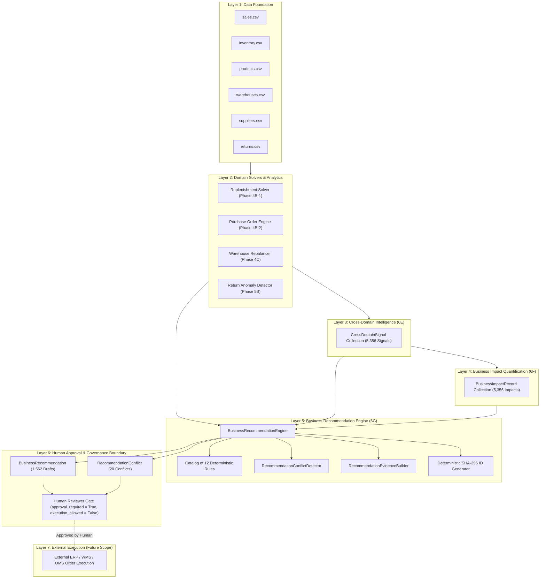
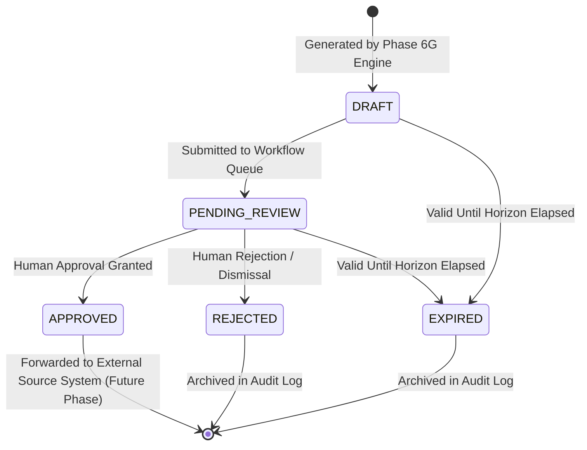

# Business Recommendation Engine (Phase 6G)

> [!IMPORTANT]
> **Governance & Operational Boundary Disclaimer**<br>
> *This module produces deterministic business recommendations for human review. It does not autonomously execute actions, establish causal relationships, or guarantee business outcomes.*

---

## 1. Objective

The **Business Recommendation Engine (Phase 6G)** represents the prescriptive synthesis layer of the eRetail AI Intelligence platform. While prior phases address foundational questions:
- **Phase 6E (Cross-Domain Signals)** answers: *"What is happening across commercial and inventory domains?"*
- **Phase 6F (Business Impact)** answers: *"How financially significant is the observed exposure?"*

**Phase 6G answers**:
> **"What action should be considered by human decision-makers based on the available verifiable evidence?"**

The purpose of Phase 6G is to synthesize:
$$\text{Cross-Domain Signals (6E)} + \text{Quantified Impact (6F)} + \text{Deterministic Domain Engines (4B, 4C, 5B)} \longrightarrow \text{Auditable Recommendations (6G)}$$

Every recommendation generated by this engine requires mandatory human approval (`approval_required = True`), strictly forbids autonomous background execution (`execution_allowed = False`), and preserves full machine-readable provenance back to input datasets and domain rules.

---

## 2. Architecture & System Hierarchy

The Business Recommendation Engine occupies a strictly governed position between analytical intelligence and human operational review:



---

## 3. Recommendation Taxonomy

Phase 6G defines a controlled, deterministic taxonomy of 12 recommendation classifications. No recommendation classification may exist without an explicit, verifiable underlying rule.

| Recommendation Type | Target Scope | Triggering Conditions & Solvers | Action Description |
| :--- | :--- | :--- | :--- |
| `REPLENISHMENT_REVIEW` | SKU $\times$ WH | Phase 4B-1 Replenishment Solver triggered with $ROQ > 0$ and net position $< ROP$ | Review existing replenishment recommendation. |
| `PURCHASE_ORDER_REVIEW` | Supplier $\times$ WH | Phase 4B-2 Purchase Order Proposal generated with valid supplier grouping | Review draft purchase order proposal. |
| `WAREHOUSE_REBALANCING_REVIEW` | Route (Src $\to$ Dest) | Phase 4C Warehouse Rebalancer identifies viable surplus-to-deficit transfer | Review existing warehouse transfer recommendation. |
| `INVENTORY_REVIEW` | SKU $\times$ WH | General inventory imbalances or coverage alerts | Review current inventory position and warehouse distribution. |
| `SLOW_MOVING_INVENTORY_REVIEW` | SKU $\times$ WH | High inventory capital coinciding with low or stagnant sales velocity | Review inventory disposition or rebalancing options. |
| `HIGH_VALUE_INVENTORY_REVIEW` | SKU $\times$ WH | Capital tied up in physical inventory exceeds portfolio threshold | Review the high-value inventory position. |
| `STOCKOUT_REVIEW` | SKU $\times$ WH | Critical inventory depletion or stockout on revenue/margin generating SKU | Review stock availability and replenishment/transfer options. |
| `RETURN_REVIEW` | SKU / Channel | Elevated return rate or return units on high revenue/low margin SKU | Review return drivers and operational handling. |
| `RETURN_ROOT_CAUSE_REVIEW` | SKU / Channel | Phase 5B identifies statistically significant return reason shift | Review the identified return reason pattern. |
| `MARGIN_REVIEW` | SKU $\times$ WH | Compressed gross or contribution margin with high holding volume | Review margin drivers and associated operating conditions. |
| `FORECAST_REVIEW` | SKU $\times$ WH | Forward forecast demand exceeds available inventory position | Review forecast coverage against current inventory. |
| `DATA_QUALITY_REVIEW` | Entity | Missing catalog master data (cost, supplier, snapshot, forecast) | Review and remediate missing upstream operational and master data. |

---

## 4. Recommendation Lifecycle

All recommendations follow an auditable state machine. The Phase 6G engine strictly emits recommendations in the `DRAFT` state:



- **Phase 6G Scope**: Creates `DRAFT` recommendations.
- **Human Approval**: Transition to `APPROVED` or `REJECTED` occurs exclusively via external human interaction.
- **Execution**: The recommendation engine contains no code or credentials to submit orders or execute stock transfers.

---

## 5. Strict Approval Boundary & Governance

Every `BusinessRecommendation` data contract enforces immutable governance fields:

```python
approval_required: bool = Field(default=True, frozen=True)
execution_allowed: bool = Field(default=False, frozen=True)
```

1. **Mandatory Human Approval**: `approval_required` is permanently frozen to `True`. Any programmatic attempt to construct or mutate a recommendation with `approval_required = False` raises a Pydantic `ValidationError`.
2. **Autonomous Execution Prohibited**: `execution_allowed` is permanently frozen to `False`. The engine cannot be configured into an "auto-execute" or "agentic executor" mode.
3. **Draft Enforcement**: Initial workflow status is strictly `RecommendationStatus.DRAFT`.
4. **Non-Prescriptive Actions**: Action strings are phrased as human directives (`"Review..."`, `"Investigate..."`), never system commands (`"Execute order"`, `"Transmit shipment"`).

---

## 6. Recommendation Rules

All recommendation logic is implemented as explicit, testable, and auditable rules inheriting from `RecommendationRule`. Rules cannot be buried inside monolithic application code.

### Canonical Rule Specifications:

1. **`RULE_REPLENISHMENT_REVIEW_001`**:
   - *Condition*: `recommendation_required = True` AND `recommended_order_qty > 0`.
   - *Action*: `"Review the existing replenishment recommendation."`
   - *Category*: `REPLENISH`
   - *Limitations*: Does not place purchase orders; requires review of supplier terms, pack size multiples, and warehouse dock capacity.

2. **`RULE_PURCHASE_ORDER_REVIEW_001`**:
   - *Condition*: Valid Phase 4B-2 `PurchaseOrderProposal` generated for a supplier-warehouse pair.
   - *Action*: `"Review the draft purchase order proposal."`
   - *Category*: `REVIEW`
   - *Limitations*: Draft proposal requiring purchasing budget authorization; does not transmit orders to external ERP/WMS.

3. **`RULE_WAREHOUSE_REBALANCING_REVIEW_001`**:
   - *Condition*: Valid Phase 4C `WarehouseTransferRecommendation` with surplus at origin and deficit at destination.
   - *Action*: `"Review the existing warehouse transfer recommendation."`
   - *Category*: `REBALANCE`
   - *Limitations*: Assumes carrier availability, transit times, and freight budget viability.

4. **`RULE_SLOW_MOVING_INVENTORY_001`**:
   - *Condition*: Signal `HIGH_INVENTORY_LOW_DEMAND` or impact `SLOW_MOVING_INVENTORY_EXPOSURE`.
   - *Action*: `"Review inventory disposition or rebalancing options."`
   - *Category*: `REVIEW`
   - *Limitations*: Does not account for forward promotional calendar or seasonal re-acceleration without forward forecast integration.

5. **`RULE_HIGH_VALUE_INVENTORY_001`**:
   - *Condition*: Signal `HIGH_VALUE_INVENTORY` or impact `HIGH_VALUE_INVENTORY_EXPOSURE`.
   - *Action*: `"Review the high-value inventory position."`
   - *Category*: `REVIEW`
   - *Limitations*: Capital concentration observation; does not imply inventory obsolescence, defect, or immediate holding risk.

6. **`RULE_STOCKOUT_REVIEW_001`**:
   - *Condition*: Signals `HIGH_REVENUE_STOCKOUT_EXPOSURE`, `HIGH_REVENUE_LOW_STOCK`, `HIGH_MARGIN_LOW_STOCK`.
   - *Action*: Linked to existing replenishment or transfer if present, otherwise `"Review stock availability and replenishment/transfer options."`
   - *Category*: `INVESTIGATE`
   - *Limitations*: Reflects lost sales exposure under historical run rate; customer brand substitution is not modeled.

7. **`RULE_RETURN_REVIEW_001`**:
   - *Condition*: Signals `HIGH_RETURN_HIGH_REVENUE`, `HIGH_RETURN_LOW_MARGIN`, `RETURN_ANOMALY_HIGH_VALUE_SKU`.
   - *Action*: `"Review return drivers and operational handling."`
   - *Category*: `INVESTIGATE`
   - *Limitations*: Correlational volume observation; root causes require physical inspection or customer feedback audit before product delisting.

8. **`RULE_RETURN_ROOT_CAUSE_001`**:
   - *Condition*: Phase 5B reason-shift anomaly signal (`RETURN_REASON_SHIFT_ANOMALY`).
   - *Action*: `"Review the identified return reason pattern."`
   - *Category*: `INVESTIGATE`
   - *Limitations*: Statistical anomaly in customer-reported reasons; does not confirm manufacturer defect or merchant liability.

9. **`RULE_MARGIN_REVIEW_001`**:
   - *Condition*: Signals `LOW_MARGIN_HIGH_INVENTORY`, `HIGH_RETURN_LOW_MARGIN`, `MARGIN_DILUTION_RISK`.
   - *Action*: `"Review margin drivers and associated operating conditions."`
   - *Category*: `REVIEW`
   - *Limitations*: Excludes unallocated corporate overhead; does not recommend pricing or markdown changes without pricing policy models.

10. **`RULE_FORECAST_REVIEW_001`**:
    - *Condition*: Signals `FORECAST_COVERAGE_EXPOSURE`, `FORECASTED_DEMAND_ABOVE_AVAILABLE_STOCK`.
    - *Action*: `"Review forecast coverage against current inventory."`
    - *Category*: `REVIEW`
    - *Limitations*: Subject to model forecasting variance and prediction intervals; does not convert forecast uncertainty into certainty.

11. **`RULE_DATA_QUALITY_REVIEW_001`**:
    - *Condition*: Upstream data missing (`MISSING_UNIT_COST`, `MISSING_SUPPLIER`, `MISSING_FORECAST`, `MISSING_INVENTORY`).
    - *Action*: `"Review and remediate missing upstream operational and master data."`
    - *Category*: `INVESTIGATE`
    - *Limitations*: Data gaps suppress automated optimization; correction must take place in the source system of record.

12. **`RULE_INVENTORY_REVIEW_001`**:
    - *Condition*: General inventory imbalance signals (`INVENTORY_IMBALANCE`, `STOCK_COVERAGE_ALERT`).
    - *Action*: `"Review current inventory position and warehouse distribution."`
    - *Category*: `REVIEW`
    - *Limitations*: General status review without forward optimization solver.

---

## 7. Rule Versioning

Every emitted recommendation record captures both `rule_id` and semantic `rule_version` (e.g. `"1.0"`).
- When a rule definition changes (thresholds, condition criteria, or action wording), its version must be updated.
- Audit trails can deterministically associate historical recommendations with the exact rule version active at generation time.

---

## 8. Evidence Model

Every recommendation embeds structured, verifiable evidence items typed via `RecommendationEvidenceType`:
- `SIGNAL`: Triggering cross-domain signal identifier and descriptive condition.
- `IMPACT`: Quantified financial exposure figure, currency, and physical units from Phase 6F.
- `DOMAIN_METRIC`: Underlying telemetry (e.g. `inventory_position`, `reorder_point`, `return_rate`).
- `ENGINE_OUTPUT`: Outputs produced by upstream deterministic solvers (e.g. `recommended_order_qty`, `transfer_quantity`).
- `DATA_QUALITY`: Identifiers for missing master data fields.

Every recommendation must include at least one `SIGNAL` or `ENGINE_OUTPUT` evidence item.

---

## 9. Financial Context

Where financial data is available, recommendations attach a structured `RecommendationFinancialContext`:
- `currency`: Default `"USD"`.
- `associated_revenue`: Historical sales revenue associated with the entity.
- `associated_margin`: Historical gross margin.
- `inventory_value`: Carrying capital valuation of physical inventory.
- `known_variable_cost`: Identified operational fulfillment costs.
- `known_contribution_margin`: Realized contribution margin.
- `exposure_value`: Total quantified risk or capital exposure.
- `proposed_purchase_value`: Proposed purchasing capital requirement.

**Missing Value Policy**: If financial data is missing or incomplete, fields remain `None`. Values are **never** fabricated or imputed.

---

## 10. Operational Context

Physical and logistical parameters are documented in `RecommendationOperationalContext`:
- `inventory_position`: Available pickable stock on hand plus on order minus reserved.
- `reorder_point`: Dynamic safety buffer threshold.
- `recommended_order_qty`: Sized replenishment requirement.
- `stockout_days`: Historical duration of stock exhaustion.
- `return_rate`: Decimal fraction of units returned.
- `demand`: Average daily customer demand units.
- `forecast`: Forward projected demand units.
- `transfer_quantity`: Sized inter-facility transfer units.
- `source_warehouse` / `destination_warehouse`: Logistics route facilities.

---

## 11. Deterministic Priority Rules

Priority is assigned deterministically without arbitrary rankings or machine learning scores:

$$\begin{aligned}
\text{CRITICAL} &\iff \text{Severity} = \text{CRITICAL} \lor \text{Urgency} = \text{CRITICAL} \lor (\text{Exposure} \ge \$10,000 \land \text{Severity} = \text{HIGH}) \\
\text{HIGH} &\iff \text{Severity} = \text{HIGH} \lor \text{Urgency} = \text{HIGH} \lor \text{Exposure} \ge \$2,500 \\
\text{MEDIUM} &\iff \text{Severity} = \text{MEDIUM} \lor \text{Urgency} = \text{MEDIUM} \lor \text{Exposure} \ge \$500 \\
\text{LOW} &\iff \text{Severity} = \text{LOW} \lor \text{Exposure} < \$500 \\
\text{INFO} &\iff \text{Severity} = \text{INFO} \lor \text{Data Quality Informational Notice}
\end{aligned}$$

Priority indicates rule threshold urgency, **not** a comparative portfolio opportunity ranking.

---

## 12. Conflict Detection & Human Review Guardrails

When contradictory signals or recommendations coexist on the same entity, the engine does **not** choose a winner. Instead, it logs an auditable `RecommendationConflict` and mandates human review.

### Supported Conflict Types:

1. **`INVENTORY_DEMAND_CONFLICT` / `REPLENISHMENT_SURPLUS_CONFLICT`**:
   - Occurs when a slow-moving or high-inventory signal coexists with an active replenishment reorder recommendation on the same entity.
   - *Explanation*: `"High inventory and replenishment signals coexist for the same SKU/warehouse. Additional review is required before selecting an action."`
2. **`RETURN_QUALITY_CONFLICT`**:
   - Occurs when an active replenishment order is recommended for a SKU currently undergoing return anomaly or quality investigation.
   - *Explanation*: `"Replenishment order recommended for SKU undergoing active return quality or reason shift investigation. Human verification of product quality is required."`
3. **`TRANSFER_REPLENISHMENT_CONFLICT`**:
   - Occurs when stock is proposed to be transferred out of a facility that simultaneously triggers local replenishment.

**Conflict Resolution Rule**: Autonomous resolution is strictly prohibited. Both recommendations are emitted with their respective evidence, and the conflict record is linked to both items with `requires_human_review = True`.

---

## 13. Duplicate Prevention & Deterministic ID Generation

Every recommendation receives a deterministic, collision-resistant identifier generated via SHA-256:

$$\text{recommendation\_id} = \text{"REC-"} + \text{SHA256}(\text{entity\_key} \parallel \text{recommendation\_type} \parallel \text{as\_of\_date} \parallel \text{rule\_id})[:16]$$

- Re-running the pipeline on identical input data produces identical recommendation IDs.
- Processing duplicate signals or redundant inputs will never generate duplicate recommendation records.

---

## 14. Machine-Readable Traceability Graph

Every recommendation preserves a complete machine-readable audit trail in `RecommendationTraceability`:
- `recommendation_id`: Target recommendation ID (`REC-xxx`).
- `supporting_signal_ids`: Source cross-domain signals (`SIG-xxx`).
- `supporting_impact_ids`: Linked financial exposure records (`IMP-xxx`).
- `domain_metrics`: Raw numerical telemetry fields evaluated.
- `source_datasets`: Originating canonical tables (e.g. `sales.csv`, `inventory.csv`, `returns.csv`).

Audit path:
$$\text{REC-xxx} \longrightarrow \text{SIG-xxx} \longrightarrow \text{IMP-xxx} \longrightarrow \text{Telemetry Metric} \longrightarrow \text{Raw CSV Snapshot}$$

---

## 15. Validity & Expiration Horizons

Recommendations are perishable operational guidance. Expiration dates are calculated deterministically from `created_as_of`:

| Recommendation Type | Validity Horizon | Expiration Rationalization |
| :--- | :--- | :--- |
| `REPLENISHMENT_REVIEW` | 7 Days | Inventory positions and open purchase orders change weekly. |
| `PURCHASE_ORDER_REVIEW` | 7 Days | Supplier pricing and stock availability fluctuate over short cycles. |
| `WAREHOUSE_REBALANCING_REVIEW` | 7 Days | Regional demand imbalances shift as sales deplete local inventory. |
| `STOCKOUT_REVIEW` | 7 Days | Immediate inventory recovery requires weekly re-evaluation. |
| `SLOW_MOVING_INVENTORY_REVIEW` | 7 Days | Synchronized with weekly inventory review cadences. |
| `HIGH_VALUE_INVENTORY_REVIEW` | 7 Days | Synchronized with weekly working capital audits. |
| `FORECAST_REVIEW` | 14 Days | Aligned with bi-weekly forecasting re-generation cycles. |
| `RETURN_REVIEW` | 30 Days | Return rates require monthly aggregation for statistical stability. |
| `RETURN_ROOT_CAUSE_REVIEW` | 30 Days | Investigation of return reason distributions spans monthly cohorts. |
| `DATA_QUALITY_REVIEW` | 3 Days | Urgent data remediation required to unblock operational pipelines. |

---

## 16. Currency Handling & Isolation

- Every financial context and monetary evidence item captures explicit ISO currency codes (default `"USD"`).
- Cross-currency aggregations are never performed without explicit exchange rate matrices.
- Currency mismatch triggers a `DATA_QUALITY_REVIEW` or is quarantined into currency-specific proposal bundles.

---

## 17. Point-in-Time Safety & Leakage Protection

The recommendation engine strictly enforces point-in-time anti-leakage guards:
- Any signal, impact, or snapshot bearing a timestamp or `as_of_date` greater than the effective evaluation cutoff is quarantined and discarded.
- Backtesting or historic scenario replay will never incorporate future return events, future purchase receipts, or future price alterations.

---

## 18. Data Quality & Incompleteness Handling

When underlying data is missing or below minimum confidence criteria:
1. The engine **never** fabricates substitute values.
2. Confidence provenance is marked `ConfidenceProvenance.INSUFFICIENT_DATA`.
3. If the missing data prevents calculation (e.g. missing unit cost or supplier ID), a `DATA_QUALITY_REVIEW` recommendation is emitted to remediate the master data defect in the source system.

---

## 19. Analytical Limitations

1. **Human Oversight Obligation**: Recommendations are analytical prompts for procurement, logistics, and merchandising professionals. They are not automated decisions.
2. **Pricing Exclusions**: The engine does not recommend retail markdowns or dynamic discount alterations.
3. **Capacity & Freight Realities**: Transfer proposals do not model real-time highway congestion, carrier strikes, or physical dock scheduling constraints.
4. **Demand Substitution**: Stockout exposure assumes unconstrained historical demand run-rates and does not model customer brand switching.
5. **No Outcome Guarantees**: Following a recommendation does not guarantee increased profit, eliminated returns, or zero stockouts.

---

## 20. Concrete Recommendation Examples

### Example 1: Replenishment Review
```json
{
  "recommendation_id": "REC-e14b281f9a2b84c3",
  "recommendation_type": "REPLENISHMENT_REVIEW",
  "status": "DRAFT",
  "priority": "HIGH",
  "severity": "HIGH",
  "sku_id": "SKU_001",
  "warehouse_id": "WH_01",
  "title": "Replenishment Review: SKU_001 at WH_01",
  "summary": "Net inventory position (40 units) has breached the reorder point (180.0 units). Recommended order quantity is 260 units.",
  "action": "Review the existing replenishment recommendation.",
  "action_category": "REPLENISH",
  "recommended_quantity": 260,
  "recommended_value": 6500.0,
  "financial_context": {
    "currency": "USD",
    "proposed_purchase_value": 6500.0,
    "exposure_value": 6500.0
  },
  "operational_context": {
    "inventory_position": 40,
    "reorder_point": 180.0,
    "recommended_order_qty": 260,
    "demand": 15.0
  },
  "rule_id": "RULE_REPLENISHMENT_REVIEW_001",
  "rule_version": "1.0",
  "confidence": "DETERMINISTIC_DERIVED",
  "approval_required": true,
  "execution_allowed": false,
  "created_as_of": "2026-06-30",
  "valid_until": "2026-07-07",
  "requires_human_review": true
}
```

### Example 2: Operational Conflict Record
```json
{
  "conflict_id": "CNF-7b19dfa428c05e19",
  "conflict_type": "RETURN_QUALITY_CONFLICT",
  "conflicting_recommendation_ids": [
    "REC-e14b281f9a2b84c3",
    "REC-82fa9144c19a2e87"
  ],
  "conflicting_signal_ids": [
    "SIG-10492819",
    "SIG-39201948"
  ],
  "entity_key": "SKU_084:WH_03",
  "explanation": "Replenishment order recommended for SKU undergoing active return quality or reason shift investigation. Human verification of product quality is required.",
  "requires_human_review": true,
  "created_as_of": "2026-06-30"
}
```
