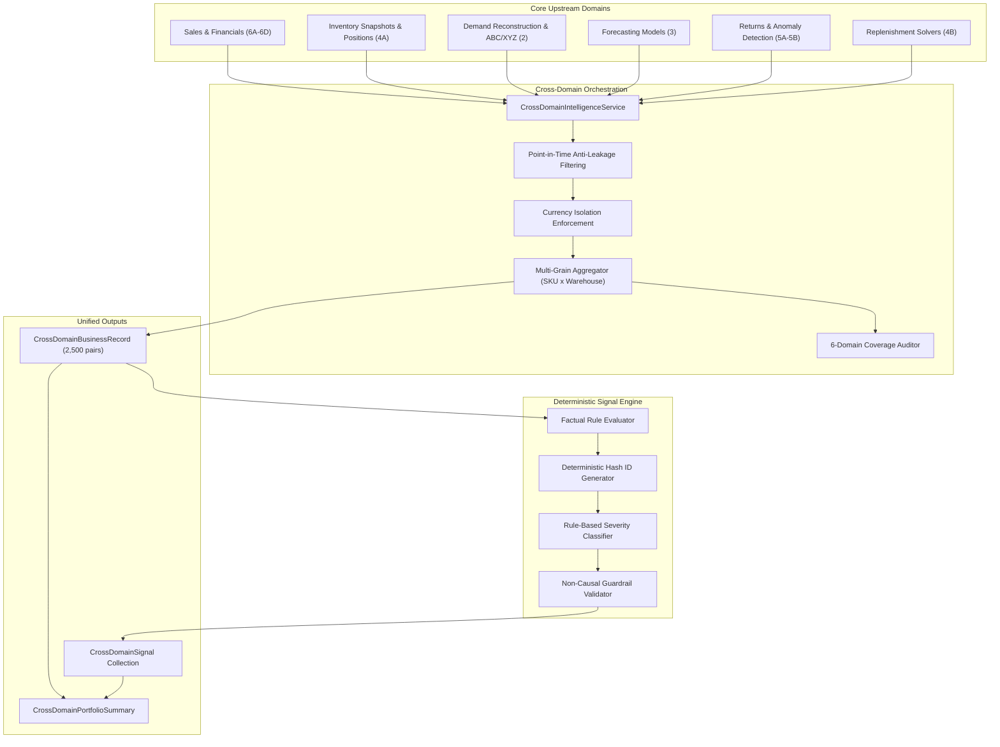

# Cross-Domain Business Intelligence (Phase 6E)

> [!IMPORTANT]
> **Descriptive Analytical Boundary Disclaimer**<br>
> *This module identifies descriptive co-occurring business signals. It does not establish causal relationships and does not make business recommendations.*

---

## 1. Objective

Cross-Domain Business Intelligence (Phase 6E) unifies the discrete analytical domains of the eRetail AI Intelligence platform into a coherent, multi-dimensional business model. Rather than evaluating commercial performance, inventory positioning, demand volatility, returns, stockouts, and replenishment in isolation, Phase 6E synthesizes these domain observations at the natural operational grains of the enterprise.

The primary objective is descriptive discovery:
- What commercial and operational conditions are observed together?
- What financial metrics describe the same SKU, channel, and warehouse entities as inventory health?
- Where do elevated return rates co-occur with high sales volume or low margins?
- How do replenishment triggers coincide with working capital valuation and demand predictability?

This module strictly operates as an observational intelligence layer. It answers **"What signals co-occur?"** and deliberately does not answer **"What should the business do?"**, preserving a strict boundary against prescriptive optimization, autonomous decision-making, and causal claims.

---

## 2. Architecture

Phase 6E acts as an analytical orchestration layer sitting atop Phase 1 through Phase 6D. It ingests validated transaction datasets, inventory snapshots, and upstream domain analytical outputs, executing high-performance vectorized joins and rule evaluations.



---

## 3. Domain Inputs

Phase 6E integrates six foundational operational and financial domains:

| Domain | Primary Source Entities | Key Metrics Extracted |
| :--- | :--- | :--- |
| **1. Financial & Sales** | `sales.csv`, `products.csv` | Gross revenue, net revenue, product cost (COGS), gross margin, gross margin %, transaction count, order count, AOV |
| **2. Inventory** | `inventory.csv` | Physical on-hand, available inventory, reserved inventory, inventory position, inventory valuation ($), days of cover |
| **3. Demand Velocity** | Daily sales time series | Average daily demand (units/day), demand standard deviation, ABC Pareto class, XYZ predictability class, intermittency classification |
| **4. Forecasting** | Model predictions | Forecast mean, forecast horizon, forecast model identifier, forecast availability flag |
| **5. Returns** | `returns.csv` | Return count, returned units, unit return rate (%), return anomaly indicator |
| **6. Replenishment** | Phase 4B replenishment logic | Reorder point (ROP), recommended order quantity (ROQ), replenishment trigger flag, replenishment risk tier |

---

## 4. Primary Grain & Supported Slices

Operational commerce occurs at the intersection of a physical item and a fulfillment facility. Therefore, the primary analytical grain of Phase 6E is:

$$\mathbf{SKU \times WAREHOUSE}$$

In the canonical enterprise portfolio (500 SKUs across 5 Warehouses), this grain produces exactly **2,500 primary business records**, enabling localized fulfillment assessment without loss of granularity.

### Supported Analytical Slices:
1. **`SKU × WAREHOUSE` (Canonical Primary)**: Complete operational and financial record for each item at each fulfillment center.
2. **`SKU`**: Rollup across fulfillment centers capturing global product portfolio dynamics (total revenue, network-wide on-hand, global return rates).
3. **`WAREHOUSE`**: Rollup across products capturing node-level throughput, total capital lockup, and facility replenishment exposure.
4. **`CHANNEL`**: Rollup across customer touchpoints (e.g. Web, Store, Amazon, Wholesale), auditing commercial revenue and return rates while explicitly documenting that physical inventory is not native to this grain.
5. **`CATEGORY` & `BRAND`**: Aggregated rollups across merchandise hierarchy.

---

## 5. Cross-Domain Schema (`CrossDomainBusinessRecord`)

Every analytical observation is materialized as an explicit, type-checked Pydantic record:

```python
class CrossDomainBusinessRecord(BaseModel):
    # Identity
    sku_id: str
    warehouse_id: Optional[str]
    channel_id: Optional[str]
    category_id: Optional[str]
    brand: Optional[str]
    currency: str = "USD"

    # Financial & Sales
    gross_revenue: Optional[float]
    net_revenue: Optional[float]
    product_cost: Optional[float]
    gross_margin: Optional[float]
    gross_margin_pct: Optional[float]
    units_sold: Optional[int]
    order_count: Optional[int]
    average_order_value: Optional[float]

    # Inventory & Capital
    current_on_hand: Optional[int]
    inventory_value: Optional[float]
    available_inventory: Optional[int]
    reserved_inventory: Optional[int]
    inventory_position: Optional[int]
    days_of_cover: Optional[float]

    # Demand & Predictability
    average_daily_demand: Optional[float]
    demand_std: Optional[float]
    abc_class: Optional[str]
    xyz_class: Optional[str]
    intermittency_class: Optional[str]

    # Stockouts & Forecasts
    stockout_days: Optional[int]
    stockout_rate: Optional[float]
    stockout_flag: Optional[bool]
    forecast_mean: Optional[float]
    forecast_horizon: Optional[int]
    forecast_model: Optional[str]
    forecast_available: bool

    # Returns & Replenishment
    return_rate: Optional[float]
    return_count: Optional[int]
    return_units: Optional[int]
    return_anomaly_flag: Optional[bool]
    reorder_point: Optional[float]
    recommended_order_qty: Optional[int]
    replenishment_trigger: Optional[bool]
    replenishment_risk: Optional[str]

    # Data Quality & Coverage
    financial_available: bool
    inventory_available: bool
    demand_available: bool
    returns_available: bool
    replenishment_available: bool
    missing_domain_count: int
    domain_coverage_pct: float
    as_of_date: Optional[str]
```

---

## 6. Signal Taxonomy & Categories

Signals represent deterministic, factual classifications of co-occurring conditions. They are partitioned across standardized categories:

| Category | Definition & Focus |
| :--- | :--- |
| `CROSS_DOMAIN` | Conditions spanning two or more distinct domains (e.g. High Revenue + Low Stock, Low Margin + High Inventory) |
| `FINANCIAL` | Commercial performance conditions within revenue, cost, or margin boundaries |
| `INVENTORY` | Physical stock levels, working capital valuation, and inventory positioning |
| `DEMAND` | Demand velocity, trend directions, and ABC/XYZ segmentation |
| `FORECAST` | Out-of-sample projection coverage and inventory comparison |
| `STOCKOUT` | Historical stockout streaks, frequency rates, and exposure |
| `RETURNS` | Product return rates, return volumes, and return rate anomalies |
| `REPLENISHMENT` | Reorder point triggers evaluated alongside financial context |
| `WAREHOUSE` | Facility-level concentration and multi-node operational context |

---

## 7. Deterministic Signal Rules

Signals are triggered strictly when explicit mathematical criteria are satisfied across observed metrics:

| Signal Type | Category | Core Criteria |
| :--- | :--- | :--- |
| `HIGH_REVENUE_LOW_STOCK` | `CROSS_DOMAIN` | $\text{net\_revenue} \ge \text{P80}_{\text{rev}} \land \text{available\_inventory} \le 10$ |
| `HIGH_MARGIN_LOW_STOCK` | `CROSS_DOMAIN` | $\text{gross\_margin} \ge \text{P80}_{\text{margin}} \land \text{available\_inventory} \le 10$ |
| `HIGH_REVENUE_STOCKOUT_EXPOSURE` | `CROSS_DOMAIN` | $\text{net\_revenue} \ge \text{P80}_{\text{rev}} \land (\text{stockout\_days} > 0 \lor \text{stockout\_rate} \ge 0.05)$ |
| `LOW_MARGIN_HIGH_INVENTORY` | `CROSS_DOMAIN` | $\text{gross\_margin\_pct} \le 20\% \land (\text{inventory\_value} \ge \text{P80}_{\text{val}} \lor \text{on\_hand} \ge 100)$ |
| `HIGH_INVENTORY_LOW_DEMAND` | `CROSS_DOMAIN` | $\text{on\_hand} \ge 100 \land (\text{daily\_demand} \le 1.0 \lor \text{abc\_class} = \text{'C'})$ |
| `HIGH_RETURN_HIGH_REVENUE` | `CROSS_DOMAIN` | $\text{return\_rate} \ge 10\% \land \text{net\_revenue} \ge \text{P80}_{\text{rev}} \land \text{sample} \ge 10\text{ units}$ |
| `HIGH_RETURN_LOW_MARGIN` | `CROSS_DOMAIN` | $\text{return\_rate} \ge 10\% \land \text{gross\_margin\_pct} \le 20\% \land \text{sample} \ge 10\text{ units}$ |
| `HIGH_MARGIN_HIGH_RETURN` | `CROSS_DOMAIN` | $\text{return\_rate} \ge 10\% \land \text{gross\_margin\_pct} \ge 50\% \land \text{sample} \ge 10\text{ units}$ |
| `LOW_REVENUE_HIGH_INVENTORY` | `CROSS_DOMAIN` | $\text{inventory\_value} \ge \text{P80}_{\text{val}} \land \text{net\_revenue} < \text{P80}_{\text{rev}}$ |
| `HIGH_VALUE_INVENTORY` | `INVENTORY` | $\text{inventory\_value} \ge \text{P80}_{\text{val}}$ |
| `LOW_VELOCITY_HIGH_VALUE` | `CROSS_DOMAIN` | $\text{inventory\_value} \ge \text{P80}_{\text{val}} \land (\text{daily\_demand} \le 1.0 \lor \text{abc\_class} = \text{'C'})$ |
| `HIGH_VALUE_STOCKOUT_EXPOSURE` | `CROSS_DOMAIN` | $\text{inventory\_value} \ge \text{P80}_{\text{val}} \land \text{stockout\_days} > 0$ |
| `FORECASTED_DEMAND_ABOVE_AVAILABLE_STOCK` | `FORECAST` | $\text{forecast\_available} \land \text{forecast\_mean} > \text{available\_inventory}$ |
| `FORECASTED_DEMAND_BELOW_CURRENT_STOCK` | `FORECAST` | $\text{forecast\_available} \land \text{available\_inventory} > (3 \times \text{forecast\_mean})$ |
| `FORECAST_UNAVAILABLE` | `FORECAST` | $\text{forecast\_available} = \text{False}$ |
| `RETURN_ANOMALY_HIGH_VALUE_SKU` | `RETURNS` | $\text{return\_anomaly\_flag} = \text{True} \land \text{inventory\_value} \ge \text{P80}_{\text{val}}$ |
| `HIGH_REVENUE_REPLENISHMENT_TRIGGER` | `REPLENISHMENT` | $\text{replenishment\_trigger} = \text{True} \land \text{net\_revenue} \ge \text{P80}_{\text{rev}}$ |
| `HIGH_MARGIN_REPLENISHMENT_TRIGGER` | `REPLENISHMENT` | $\text{replenishment\_trigger} = \text{True} \land \text{gross\_margin} \ge \text{P80}_{\text{margin}}$ |
| `LOW_MARGIN_REPLENISHMENT_TRIGGER` | `REPLENISHMENT` | $\text{replenishment\_trigger} = \text{True} \land \text{gross\_margin\_pct} \le 20\%$ |
| `HIGH_VALUE_REPLENISHMENT_TRIGGER` | `REPLENISHMENT` | $\text{replenishment\_trigger} = \text{True} \land \text{inventory\_value} \ge \text{P80}_{\text{val}}$ |

---

## 8. Rule-Based Severity Classification

Signal severity is assigned purely through deterministic rule logic:

| Severity Level | Criteria & Analytical Purpose |
| :--- | :--- |
| **`CRITICAL`** | Severe co-occurrences: stockouts on high-revenue items ($\text{available} \le 0$ on top revenue SKUs), or return anomalies on top-valuation inventory. |
| **`HIGH`** | High-exposure conditions: top-percentile revenue or margin paired with low stock ($1 \le \text{available} \le 10$), high return rates on top revenue, low velocity on high capital lockup, active replenishment triggers on top revenue/margin. |
| **`MEDIUM`** | Notable co-occurrences: low margins paired with high inventory, high inventory on low-demand items, high-margin items exhibiting elevated returns, high-valuation replenishment triggers. |
| **`LOW`** | Contextual observations: active replenishment triggers on low-margin items. |
| **`INFO`** | Neutral informational facts: top-percentile inventory valuation, forecast coverage gaps (`FORECAST_UNAVAILABLE`), or stock exceeding 3x forecast demand. |

---

## 9. Financial Integration

Commercial metrics are derived directly from transactions joined with product catalog valuation:
- Realized Net Revenue is calculated per $(s, w)$ pair as $\sum \text{revenue}$.
- Procurement Cost of Goods Sold is calculated as $\sum (\text{quantity} \times \text{unit\_cost})$.
- Realized Gross Margin is computed as $\text{net\_revenue} - \text{product\_cost}$.
- Gross Margin % enforces zero-denominator protection: if $\text{net\_revenue} \le 0$, $\text{gross\_margin\_pct} = 0.0$.

---

## 10. Inventory Integration

Inventory metrics capture the physical and economic state of goods at fulfillment locations:
- Current physical on-hand equals available unreserved units plus units allocated to open customer orders ($\text{on\_hand} = \text{available} + \text{reserved}$).
- Inventory Valuation is established by extending physical on-hand by standard unit procurement cost ($\text{inventory\_value} = \text{on\_hand} \times \text{unit\_cost}$).
- Net inventory position accounts for open purchase orders and reserved orders ($\text{net\_position} = \text{on\_hand} + \text{on\_order} - \text{reserved}$).

---

## 11. Demand Integration

Demand analysis computes regularized velocity and statistical variability:
- Average Daily Demand is established across continuous calendar grids (with non-selling days treated as 0 demand).
- Pareto ABC classification assigns items into Class A (top 80% revenue), Class B (next 15%), and Class C (remaining 5%).
- Predictability XYZ classification segments demand stability using Coefficient of Variation ($CV = \sigma / \mu$): Class X ($CV \le 0.50$), Class Y ($0.50 < CV \le 1.00$), and Class Z ($CV > 1.00$ or dormant).

---

## 12. Forecast Integration

Out-of-sample demand forecasts (from Phase 3) are mapped directly onto the primary grain:
- Where forecasts exist, projected mean demand is compared against available physical stock.
- When no forecast output is supplied, the system explicitly audits this coverage deficit, recording `forecast_available = False` and emitting neutral `FORECAST_UNAVAILABLE` signals without halting downstream processing.

---

## 13. Stockout Integration

Stockout periods (from Phase 2 and 4A) are linked directly to commercial outcomes:
- Records track consecutive days in stockout and stockout proportion ($\text{stockout\_days} / \text{total\_period\_days}$).
- Crucially, stockout days are **not** arbitrarily converted into speculative "lost revenue" figures without a verified unconstrained demand model.

---

## 14. Returns Integration

Customer returns (from Phase 5A and 5B) are consolidated alongside sales volumes:
- Unit return rate is evaluated as $\text{returned\_units} / \text{units\_sold}$.
- To prevent statistical skew on micro-samples (e.g., 1 return on 1 sale = 100% return rate), return rate signals enforce minimum sample size thresholds ($\ge 10$ units sold and $\ge 5$ orders).

---

## 15. Replenishment Integration

Phase 4B replenishment solver states are contextualized commercially:
- Records expose active reorder triggers ($\text{net\_position} \le \text{ROP}$) and suggested batch order sizes.
- Crucially, Phase 6E does not generate new purchase recommendations; it enriches existing operational replenishment triggers with revenue, margin, and capital lockup context.

---

## 16. Warehouse Integration

Multi-node operational comparisons are performed factually:
- Cross-warehouse records reveal inventory balance and throughput across nodes.
- In accordance with analytical guidelines, warehouses are never ranked as "best" or "worst"; empirical throughput differences are reported neutrally.

---

## 17. Domain Coverage Auditing

Cross-domain records explicitly audit the completeness of underlying information across six foundational domains:

$$\text{Domain Coverage \%} = \frac{\sum_{i=1}^{6} \mathbf{1}(\text{Domain}_i \text{ Available})}{6} \times 100\%$$

Each record and portfolio summary tracks:
- `financial_available`
- `inventory_available`
- `demand_available`
- `forecast_available`
- `returns_available`
- `replenishment_available`
- `missing_domain_count` ($0 \dots 6$)
- `domain_coverage_pct` ($0.0\% \dots 100.0\%$)

Coverage is explicitly treated as **data completeness**, distinctly separate from data quality accuracy.

---

## 18. Currency Isolation

Monetary amounts across financial, inventory valuation, and unit economics are strictly isolated by ISO currency code:
- Multi-currency transactions (e.g. mixing USD and INR) are prohibited from naive mathematical summation without explicit FX conversion.
- Cross-domain services enforce currency consistency, failing fast if conflicting currencies are detected in a single unharmonized batch.

---

## 19. Point-in-Time Anti-Leakage Safety (`as_of_date`)

All six domains strictly honor historical cutoff dates:
- Sales transactions occurring after `as_of_date` are strictly excluded from revenue, units sold, and demand velocity.
- Returns logged after `as_of_date` are strictly omitted from return rates and counts.
- Inventory snapshots after `as_of_date` are suppressed.
- No future information leaks into historical evaluation points.

---

## 20. Known Limitations

1. **Synthetic Generation Artifacts**: In the canonical synthetic dataset, warehouse gross margins are closely aligned (~50.06%), reflecting uniform catalog pricing rather than real-world regional freight variances.
2. **Forecast Ingestion Dependency**: When external forecast models have not been evaluated for an entity, forecast coverage is reported as 0.0% and defaults to informational coverage gap flags.
3. **No Dynamic Price Elasticity**: The module observes historical transactions and does not estimate hypothetical sales volumes under alternative price points.

---

## 21. No-Causality Boundary & Guardrails

Phase 6E enforces strict guardrails against causal claims:
- Generated text is audited against forbidden terms: `"caused"`, `"resulted in"`, `"because of"`, `"drove"`, `"responsible for"`, `"best"`, `"worst"`, `"recommend"`, `"should"`.
- Approved observational phrasing includes: `"associated with"`, `"coincides with"`, `"observed alongside"`, `"correlated descriptively"`, `"co-occurs with"`.

---

## 22. Empirical Benchmark on Canonical Dataset (773,555 Records)

The cross-domain engine was evaluated against the canonical synthetic dataset (`data/sample/`):

```
============================================================
CANONICAL DATASET BENCHMARK RESULTS (PHASE 6E)
============================================================
Total Primary Records (SKU x Warehouse): 2,500 (500 SKUs x 5 Warehouses)
Total Sales Transactions Processed:     773,555 rows
Total Inventory Snapshots Processed:    292,500 rows
Total Execution Runtime:                5.54 seconds
Total Network Net Revenue:              $274,963,904.96
Total Network Gross Margin:             $137,650,632.73
Total Network Inventory Valuation:      $14,999,153.44

--- DOMAIN COVERAGE AUDIT ---
  financial_coverage_pct        : 99.60% (2,490 of 2,500 pairs)
  inventory_coverage_pct        : 100.00%
  demand_coverage_pct           : 100.00%
  forecast_coverage_pct         : 0.00% (raw sample dataset has no pre-run forecast table)
  returns_coverage_pct          : 91.12%
  replenishment_coverage_pct    : 100.00%
  average_domain_coverage_pct   : 81.78% (~5 of 6 domains available)

--- SIGNAL DISTRIBUTION BY CATEGORY ---
  FORECAST                 :  2,500 ( 46.7%)
  INVENTORY                :    474 (  8.8%)
  RETURNS                  :    117 (  2.2%)
  REPLENISHMENT            :    448 (  8.4%)
  CROSS_DOMAIN             :  1,817 ( 33.9%)
  Total Signals            :  5,356

--- SIGNAL DISTRIBUTION BY SEVERITY ---
  INFO                     :  2,974 ( 55.5%)
  CRITICAL                 :    185 (  3.5%)
  HIGH                     :    932 ( 17.4%)
  MEDIUM                   :  1,265 ( 23.6%)

--- TOP SIGNAL TYPES BY FREQUENCY ---
  FORECAST_UNAVAILABLE                    :  2,500 ( 46.7%)
  HIGH_VALUE_INVENTORY                    :    474 (  8.8%)
  HIGH_INVENTORY_LOW_DEMAND               :    437 (  8.2%)
  LOW_REVENUE_HIGH_INVENTORY              :    364 (  6.8%)
  HIGH_MARGIN_HIGH_RETURN                 :    356 (  6.6%)
  LOW_VELOCITY_HIGH_VALUE                 :    283 (  5.3%)
  HIGH_MARGIN_REPLENISHMENT_TRIGGER       :    225 (  4.2%)
  HIGH_REVENUE_REPLENISHMENT_TRIGGER      :    221 (  4.1%)
  RETURN_ANOMALY_HIGH_VALUE_SKU           :    117 (  2.2%)
  HIGH_MARGIN_LOW_STOCK                   :    112 (  2.1%)
  HIGH_REVENUE_LOW_STOCK                  :    107 (  2.0%)
  HIGH_VALUE_RETURN_EXPOSURE              :    106 (  2.0%)
============================================================
```
