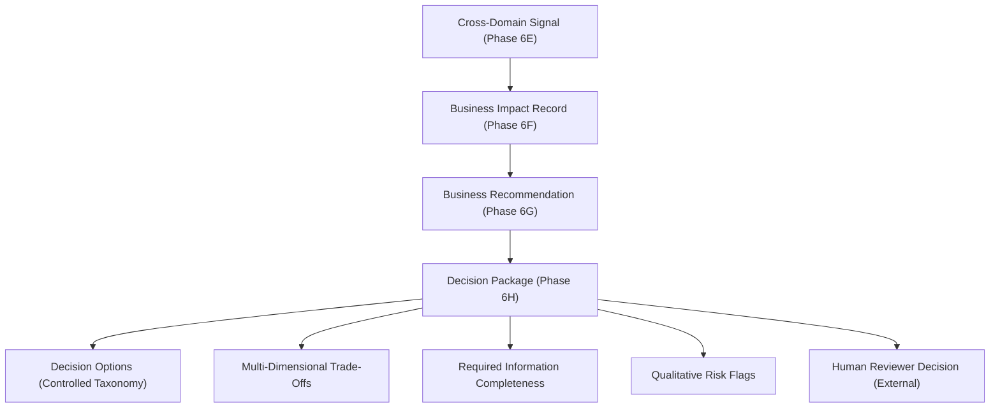
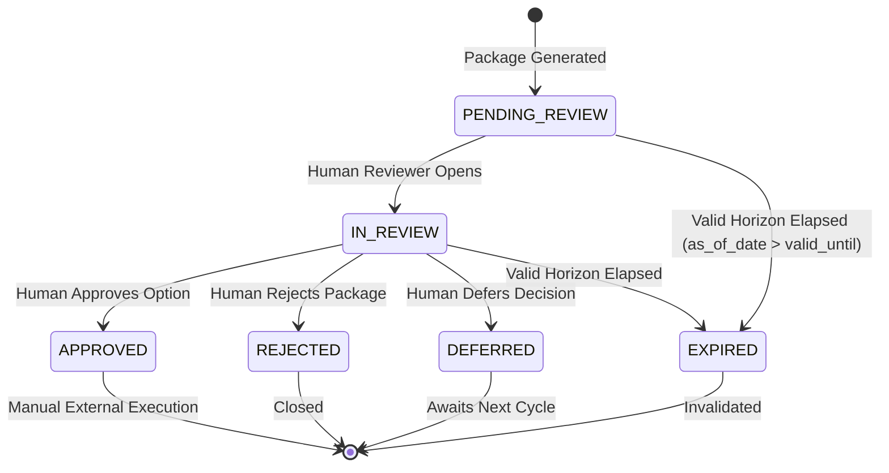

# Decision Intelligence & Action Planning (Phase 6H)

> [!IMPORTANT]
> **Core Governance Principles**:
> Phase 6H is a deterministic decision-support layer. It transforms Phase 6G business recommendations into structured, auditable decision packages for human business reviewers.
> **Phase 6H does not select a winning option, execute business actions, establish causal relationships, or guarantee outcomes.**

---

## 1. Objective

Phase 6G answered:
> *"What should be reviewed?"*

Phase 6H answers:
> *"What does the business user need to know before deciding what to do?"*

Phase 6H establishes a deterministic, auditable decision-support layer that synthesizes:
- Candidate decision options
- Objective, multi-dimensional trade-offs
- Required information completeness tracking
- Qualitative operational risk flags
- Complete machine-readable evidence and provenance traceability

All processing is strictly deterministic, non-generative, and operates under strict Human-in-the-Loop governance (`approval_required=True`, `execution_allowed=False`, `selected_option=None`).

---

## 2. Architecture

Phase 6H consumes recommendations from Phase 6G and downstream signals from Phase 6E and Phase 6F without duplicating calculations or recreating recommendation rules.



---

## 3. Decision Package

Each decision package is represented by the [`DecisionPackage`](file:///src/commerce_ai/decision_intelligence/schemas.py) model and carries the following fields:

| Field | Type | Description |
| :--- | :--- | :--- |
| `decision_id` | `str` | Deterministic SHA-256 identifier starting with `DEC-`. |
| `recommendation_id` | `str` | Originating recommendation identifier (`REC-xxx`). |
| `recommendation_type` | `RecommendationType` | Recommendation category from the 12-type taxonomy. |
| `decision_status` | `DecisionStatus` | Lifecycle workflow status (`PENDING_REVIEW`, `EXPIRED`, etc.). |
| `decision_title` | `str` | Actionable, concise title generated by deterministic template. |
| `decision_summary` | `str` | Structured, non-causal summary of operational context and trade-offs. |
| `entity_context` | `DecisionEntityContext` | Physical entity coordinates (`sku_id`, `warehouse_id`, `channel_id`, `entity_key`). |
| `business_context` | `DecisionBusinessContext` | Governance, priority, severity, rule ID, and confidence provenance. |
| `financial_context` | `RecommendationFinancialContext` | Revenue, gross margin, carrying value, and exposure figures. |
| `operational_context` | `RecommendationOperationalContext`| Inventory position, ROP, order qty, transfer qty, return rate. |
| `evidence` | `List[RecommendationEvidence]` | Supporting empirical metrics with source IDs. |
| `decision_options` | `List[DecisionOption]` | Discrete, auditable action options presented to the human reviewer. |
| `trade_offs` | `List[DecisionTradeOff]` | Trade-off assessments across operational dimensions. |
| `required_information` | `List[RequiredDecisionInformation]`| Status of required information fields (available vs. unavailable). |
| `risk_flags` | `List[DecisionRiskFlag]` | Informational operational risk flags. |
| `conflicts` | `List[RecommendationConflict]` | Contradictions propagated from Phase 6G. |
| `approval_required` | `bool` | Strictly `True` (frozen, non-negotiable). |
| `execution_allowed` | `bool` | Strictly `False` (frozen, autonomous execution prohibited). |
| `selected_option` | `Optional[str]` | Strictly `None` (engine never declares a winner). |
| `requires_human_review`| `bool` | Strictly `True` for all pending packages. |
| `created_as_of` | `date` | Point-in-time snapshot date. |
| `valid_until` | `date` | Expiration date inherited from recommendation. |
| `rule_version` | `str` | Rule version (`1.0`). |
| `traceability` | `DecisionTraceability` | Full machine-readable lineage graph. |

---

## 4. Decision Lifecycle

The decision package workflow lifecycle is managed by [`DecisionStatus`](file:///src/commerce_ai/decision_intelligence/schemas.py):



> [!NOTE]
> Phase 6H generates packages in the `PENDING_REVIEW` state (or `EXPIRED` if generated past the validity horizon). Phase 6H does not execute approved decisions.

---

## 5. Decision Options

A decision package presents multiple discrete action options without declaring a winner or auto-selecting an outcome (`selected_option = None`).

### Controlled Taxonomy

All options are strictly classified under [`DecisionOptionType`](file:///src/commerce_ai/decision_intelligence/schemas.py):
1. `REVIEW_ONLY`: Review operational status without taking physical action.
2. `REPLENISHMENT_REVIEW`: Review proposed replenishment order sizing.
3. `PURCHASE_ORDER_REVIEW`: Review draft multi-line purchase order bundle.
4. `TRANSFER_REVIEW`: Review proposed inter-warehouse stock transfer.
5. `INVENTORY_REVIEW`: Conduct physical inventory audit or count reconciliation.
6. `DEMAND_REVIEW`: Audit demand velocity, catalog specifications, or customer substitution.
7. `RETURN_REVIEW`: Audit product return inspection notes and warehouse triage.
8. `MARGIN_REVIEW`: Review product cost structure and operational fee deductions.
9. `DATA_REVIEW`: Remediate missing or incomplete master data attributes.
10. `DEFER_DECISION`: Defer decision to subsequent operational observation cycle.
11. `NO_CHANGE`: Maintain current operational strategy without changes.

---

## 6. Trade-Offs

Trade-offs evaluate potential outcomes across competing operational dimensions using conditional language:

| Dimension | Typical Potential Positive Outcome | Typical Potential Negative Outcome | Underlying Uncertainty |
| :--- | :--- | :--- | :--- |
| `INVENTORY_CAPITAL` | May reduce capital tied up in excess stock. | May reduce buffer against demand spikes. | Depends on future demand stability. |
| `SERVICE_LEVEL` | May restore order fill rates and cut stockouts. | Incurs purchase capital and storage space. | Depends on supplier delivery lead times. |
| `HOLDING_COST` | May prevent carrying cost drag on slow movers. | May incur transfer freight or handling overhead. | Depends on warehouse carrying fee rates. |
| `OPERATIONAL_WORKLOAD` | Conserves labor through consolidated batch review. | Requires manual inspection effort. | Depends on reviewer tooling and capacity. |
| `MARGIN_PROTECTION` | May identify wholesale cost inflation. | Does not change realized margin immediately. | Depends on supplier contract renegotiation. |
| `DATA_INTEGRITY` | Restores downstream solver coverage. | Requires manual cross-system record updates. | Depends on source system data availability. |

> [!WARNING]
> Trade-offs **never** claim that an effect *will* happen. Phrasing strictly uses `"may"`, `"could"`, and `"depends on"`.

---

## 7. Required Information

The engine tracks the availability of critical operational information required to make an informed decision:

- `current_inventory`: On-hand and reserved physical inventory (`inventory.csv`).
- `supplier_lead_time`: Contracted delivery days (`suppliers.csv`).
- `unit_cost`: Product acquisition cost (`products.csv`).
- `forecast_demand`: Statistical forward projection (`forecasting_service`).
- `route_transit_capacity`: Freight route lane transit schedule (`routes.csv`).
- `procurement_budget_authorization`: Purchasing budget approval (`erp_budget`).
- `return_processing_cost`: Direct processing cost per return (`returns.csv`).

If a required field is absent from the dataset, it is marked `availability = InformationAvailability.UNAVAILABLE`. **Phase 6H never fabricates missing information.**

---

## 8. Risk Flags

Informational operational risks are categorized under [`RiskFlagType`](file:///src/commerce_ai/decision_intelligence/schemas.py):
- `DATA_QUALITY_RISK`: Incomplete telemetry or multi-currency inconsistency.
- `FORECAST_UNCERTAINTY`: Unavailability of forward forecasts or wide prediction intervals.
- `INVENTORY_RISK`: Significant capital concentration or active stockout duration.
- `RETURN_RISK`: Elevated customer return rate ($\ge 10\%$).
- `MARGIN_RISK`: Operating margin compression ($\le 20\%$).
- `SUPPLIER_RISK`: Supplier ordering thresholds or lead-time variance.
- `LOGISTICS_RISK`: Inter-facility transit costs or dock congestion.
- `CONFLICT_RISK`: Operational contradictions detected in Phase 6G.
- `INSUFFICIENT_EVIDENCE`: Supporting evidence derived from fallback estimation.

Severity tiers: `LOW`, `MEDIUM`, `HIGH`, `CRITICAL`. **Risk flags are strictly informational; they are never converted into pseudo-statistical probability scores.**

---

## 9. Conflict Handling

Operational conflicts detected in Phase 6G (e.g. `RETURN_QUALITY_CONFLICT`, `INVENTORY_DEMAND_CONFLICT`) are propagated directly into the decision package:
- The package attaches a `CONFLICT_RISK` flag with `HIGH` or `CRITICAL` severity.
- `requires_human_review = True` is reinforced.
- Conflicting recommendations and signals are detailed in `conflicts`.
- **Conflicts are never automatically resolved.**

---

## 10. Evidence

Every decision package preserves empirical evidence items from upstream recommendations, cross-domain signals, and impact quantifications:
- `source_id`: Originating record or signal ID.
- `metric`: Specific metric evaluated (e.g. `net_inventory_position`, `reorder_point`, `return_rate`).
- `value`: Numerical or categorical value.
- `unit`: Units of measurement (`units`, `days`, `pct`, etc.).
- `currency`: Monetary currency code if financial.
- `description`: Plain-language explanation of why the evidence is relevant.

---

## 11. Financial Context

Financial figures are preserved directly from Phase 6F impact quantifications:
- `associated_revenue`: Associated gross or net revenue.
- `associated_margin`: Associated gross margin.
- `inventory_value`: Carrying value of physical inventory.
- `exposure_value`: Quantified financial exposure.
- `proposed_purchase_value`: Solved order capital commitment.
- `currency`: Isolated single currency code (`USD`).

Confidence provenance tiers (`DIRECT_OBSERVED`, `DETERMINISTIC_DERIVED`, `MODEL_BASED`, `INSUFFICIENT_DATA`) are carried forward without modification.

---

## 12. Operational Context

Physical and logistical parameters are carried forward to give the business reviewer full operational visibility:
- `inventory_position`: Available on-hand stock.
- `reorder_point`: Dynamic reorder point threshold.
- `recommended_order_qty`: Solved replenishment order units.
- `stockout_days`: Observed stockout duration.
- `return_rate`: Customer return percentage.
- `demand`: Average daily demand velocity.
- `forecast`: Forward projected demand units.
- `transfer_quantity`: Inter-warehouse transfer units.
- `source_warehouse` / `destination_warehouse`: Inter-facility movement nodes.

---

## 13. Traceability

Phase 6H completes the unbroken machine-readable audit trail:

$$\text{Decision Package} \longrightarrow \text{Business Recommendation} \longrightarrow \text{Cross-Domain Signal} \longrightarrow \text{Business Impact} \longrightarrow \text{Domain Metric} \longrightarrow \text{Source Dataset}$$

Reviewers can trace every proposed option and risk flag back to the exact rows in `sales.csv`, `inventory.csv`, `products.csv`, or `returns.csv`.

---

## 14. Expiration

Decision packages inherit validity dates from Phase 6G recommendations.
- If `as_of_date > valid_until`, the package is automatically assigned `decision_status = DecisionStatus.EXPIRED`.
- Expired decision packages cannot be approved; they must be re-evaluated against fresh telemetry.
- Decisions are never automatically renewed.

---

## 15. Currency Handling

Decision packages enforce strict single-currency isolation:
- A decision package carries a single currency context (`currency = "USD"`).
- If financial evidence contains mixed currencies (e.g. `EUR` mixed with `USD`), the engine flags a `DATA_QUALITY_RISK` with `CRITICAL` severity and enforces `requires_human_review = True`.
- Currencies are never blended, converted with unversioned FX rates, or combined across items.

---

## 16. Point-in-Time Safety

To prevent look-ahead bias and data leakage:
- Every decision package respects the `as_of_date` parameter.
- All evidence timestamps and recommendation creation dates must be $\le \text{as\_of\_date}$.
- If an input recommendation has `created_as_of > as_of_date`, the service raises a `ValueError` to block future-data contamination.

---

## 17. Governance

| Rule | Enforcement | Guarantee |
| :--- | :--- | :--- |
| **Human Approval** | `approval_required = True` (Frozen) | No action can proceed without human approval. |
| **No Autonomous Execution** | `execution_allowed = False` (Frozen) | Engine cannot execute orders, transfers, or edits. |
| **No Winner Selection** | `selected_option = None` | Engine presents options neutrally; human chooses. |
| **No Pricing Manipulation** | Prohibited in Option Builders | Engine never recommends price cuts or discounts. |
| **No Fabricated Evidence** | Unavailable data marked `UNAVAILABLE` | Missing fields are transparently flagged. |

---

## 18. Limitations

1. **Decision Support, Not Execution**: Phase 6H produces decision packages for human reviewers; it does not dispatch EDI messages, API calls, or database writes to external ERP/WMS systems.
2. **Dependent on Upstream Data**: If upstream solvers (Phases 4B, 4C) were not run, options requiring solved quantities (e.g. transfer review, replenishment review) are suppressed to prevent unsized suggestions.
3. **Non-Causal**: Phase 6H identifies statistical associations and deterministic thresholds; it does not estimate causal treatment effects or guarantee sales uplift.

---

## 19. Examples

### Example A: Replenishment Decision Package

```json
{
  "decision_id": "DEC-cddb83816fdf1cb9",
  "recommendation_id": "REC-0123456789abcdef",
  "recommendation_type": "REPLENISHMENT_REVIEW",
  "decision_status": "PENDING_REVIEW",
  "decision_title": "Replenishment Order Decision: SKU_001 at WH_01",
  "decision_summary": "Replenishment review is presented for decision because inventory position (40) is below the calculated reorder point (180.0). A solved replenishment order of 260 units is proposed...",
  "entity_context": {
    "sku_id": "SKU_001",
    "warehouse_id": "WH_01",
    "entity_key": "SKU_001:WH_01"
  },
  "financial_context": {
    "currency": "USD",
    "proposed_purchase_value": 6500.0,
    "exposure_value": 6500.0
  },
  "decision_options": [
    {
      "option_id": "OPT-5b8ef21d8b74",
      "option_type": "REPLENISHMENT_REVIEW",
      "title": "Review and Validate Replenishment Sizing",
      "expected_effect": "May prevent stock depletion and support product availability; may require capital outlay...",
      "requires_external_action": true,
      "recommended_by_engine": false
    },
    {
      "option_id": "OPT-a9f831bd0182",
      "option_type": "DEFER_DECISION",
      "title": "Defer Replenishment Decision",
      "expected_effect": "May preserve near-term cash flow; could increase risk of stockout...",
      "requires_external_action": false,
      "recommended_by_engine": false
    },
    {
      "option_id": "OPT-d38bc9120711",
      "option_type": "NO_CHANGE",
      "title": "Maintain Current Inventory Without Ordering",
      "expected_effect": "Avoids purchase capital expenditure; could result in unmet customer orders...",
      "requires_external_action": false,
      "recommended_by_engine": false
    }
  ],
  "selected_option": null,
  "approval_required": true,
  "execution_allowed": false
}
```
