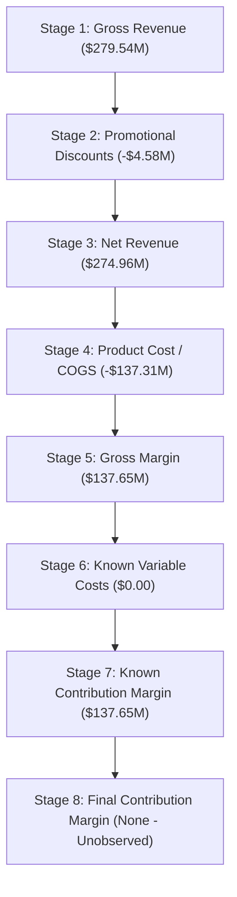

# Phase 6C — Profitability Attribution & Margin Drivers

## Executive Summary

Phase 6C completes the foundational financial intelligence tier of the **eRetail AI Intelligence** platform by providing a deterministic, auditable profitability attribution layer built on top of Phase 6A (Revenue & Gross Margin Intelligence) and Phase 6B (Cost Breakdown & True Unit Economics).

Phase 6C provides definitive answers to core commercial questions:
1. **Where is gross margin being generated and concentrated?**
2. **Where is gross margin being eroded by discounts or cost disparities?**
3. **Which products, sales channels, and fulfillment facilities contribute disproportionately to revenue versus profit?**
4. **How concentrated is commercial profit across the product catalog?**

All metrics are purely descriptive, mathematical calculations derived directly from transactional sales and product catalog records. No black-box machine learning, generative AI, LLMs, or autonomous business decisioning are used.

---

## 1. Architectural Design & Dimensional Cuts

The attribution engine aggregates transactional data across **8 dimensional cuts**:

| Dimensional Cut | Key Components | Business Purpose |
| :--- | :--- | :--- |
| **SKU** | `sku_id` | Granular product-level contribution, profit profiling, and driver classification |
| **Category** | `category_id` | Merchandising portfolio health and category margin mix |
| **Brand** | `brand` | Vendor and brand partnership margin profitability |
| **Channel** | `channel_id` | Commercial channel margin efficiency and marketplace fee trade-offs |
| **Warehouse** | `warehouse_id` | Facility margin generation and regional fulfillment volume comparison |
| **SKU × Channel** | `sku_id \| channel_id` | Channel-specific product performance and promotional variance |
| **SKU × Warehouse** | `sku_id \| warehouse_id` | Regional product stocking economics and fulfillment margin impact |
| **Channel × Warehouse** | `channel_id \| warehouse_id` | Fulfillment network routing efficiency across commercial channels |

In addition, **Temporal Attribution** aggregates performance across **Daily (`YYYY-MM-DD`)**, **Weekly (`YYYY-Www`)**, and **Monthly (`YYYY-MM`)** grains.

---

## 2. Core Mathematical Formulations

### 2.1 Revenue & Margin Contribution Shares
For any segment $i$ within dimension $D$:
$$\text{revenue\_contribution\_pct}_i = \frac{\text{net\_revenue}_i}{\text{portfolio\_net\_revenue}}$$
$$\text{margin\_contribution\_pct}_i = \frac{\text{gross\_margin}_i}{\text{portfolio\_gross\_margin}}$$

### 2.2 Contribution Gap (Revenue vs. Margin Disparity)
$$\text{contribution\_gap}_i = \text{margin\_contribution\_pct}_i - \text{revenue\_contribution\_pct}_i$$
$$\text{absolute\_contribution\_gap}_i = |\text{contribution\_gap}_i|$$

- **Positive Gap ($\text{contribution\_gap} > 0$)**: Segment generates a higher share of the company's profit than its top-line revenue share (high-margin efficiency anchor).
- **Negative Gap ($\text{contribution\_gap} < 0$)**: Segment generates a lower share of the company's profit than its top-line revenue share (margin dilution / volume subsidizer).

### 2.3 Promotional Discount Impact Invariant
The financial engine enforces an exact mathematical identity between pre-discount and post-discount margins:
$$\text{margin\_before\_discount} = \text{gross\_revenue} - \text{product\_cost}$$
$$\text{margin\_after\_discount} = \text{net\_revenue} - \text{product\_cost}$$
$$\text{discount\_margin\_impact} = \text{margin\_after\_discount} - \text{margin\_before\_discount} \equiv -\text{discount}$$

### 2.4 Discount Bucket Segmentation
Transactions are partitioned into 6 standardized discount rate tiers:
1. `0%`: Full price sales ($\text{rate} \le 10^{-6}$)
2. `0-5%`: Minimal promotional discount ($0 < \text{rate} \le 0.05$)
3. `5-10%`: Moderate discount ($0.05 < \text{rate} \le 0.10$)
4. `10-20%`: Standard promotional campaign ($0.10 < \text{rate} \le 0.20$)
5. `20-30%`: High promotional discount ($0.20 < \text{rate} \le 0.30$)
6. `30%+`: Deep clearance / promotional spike ($\text{rate} > 0.30$)

---

## 3. Margin Concentration & Contribution Curve

The concentration module evaluates the Pareto distribution of profits across the product catalog:
- **Percentile Tiers**: Evaluates Top 1%, Top 5%, Top 10%, and Top 20% of segments ranked descending by `gross_margin`.
- **Top N Cutoff**: $top\_n = \min(N, \max(1, \lceil N \times p \rceil))$ ensuring deterministic integer bounds.
- **Ordered Contribution Curve**: Output vector with 1-indexed ranks, cumulative margins, cumulative revenues, and cumulative contribution percentages.

---

## 4. Margin Driver Classifications & Reason Codes

### 4.1 Classifications (`MarginDriverClassification`)
- `HIGH_REVENUE_LOW_MARGIN_SHARE`: Contribution gap $\le -0.02$ with substantial revenue share.
- `LOW_REVENUE_HIGH_MARGIN_SHARE`: Contribution gap $\ge +0.02$.
- `HIGH_DISCOUNT`: Promotional discount rate $\ge 20\%$.
- `NEGATIVE_MARGIN`: Realized gross margin $< \$0.00$.
- `LOW_MARGIN`: Realized gross margin percentage $< 20\%$ (and $\ge 0\%$).
- `HIGH_MARGIN_CONTRIBUTOR`: Contributes $\ge 5\%$ of portfolio gross margin.
- `HIGH_REVENUE_HIGH_MARGIN`: Strong portfolio anchor ($\ge 2\%$ revenue share, $\ge 20\%$ gross margin).
- `LOW_REVENUE_LOW_MARGIN`: Low volume, low margin segment ($< 0.5\%$ revenue share, $< 20\%$ gross margin).

### 4.2 Deterministic Reason Codes (`AttributionReasonCode`)
- `NEGATIVE_GROSS_MARGIN`: Realized net revenue is less than product procurement cost.
- `LOW_GROSS_MARGIN_PERCENT`: Gross margin percentage is below policy threshold.
- `HIGH_DISCOUNT`: Promotional discounts severely exceed baseline thresholds.
- `LOW_MARGIN_CONTRIBUTION`: Disproportionately small share of portfolio gross profit.
- `HIGH_REVENUE_CONTRIBUTION`: High volume / revenue contribution.
- `CONTRIBUTION_GAP_DEFICIT`: Significant negative gap between margin share and revenue share.

---

## 5. Commercial Portfolio Margin Waterfall

The executive margin waterfall presents the step-down sequence of economic value:

---

## 6. Canonical Dataset Evaluation (773,555 Records)

Evaluation against the verified repository dataset:

### 6.1 Portfolio Aggregates
- **Total Transactions**: 773,555
- **Distinct Orders**: 773,555
- **Physical Units Sold**: 2,171,966
- **Gross Revenue**: \$279,544,322.20
- **Total Promotional Discount**: \$4,580,417.24 (Effective Discount Rate: **1.64%**)
- **Net Revenue**: \$274,963,904.96
- **Product Cost (COGS)**: \$137,313,272.23
- **Realized Gross Margin**: \$137,650,632.73 (Gross Margin %: **50.06%**)
- **Margin per Unit**: \$63.38
- **Revenue per Unit**: \$126.60
- **Average Order Value (AOV)**: \$355.45

### 6.2 Margin Concentration Tiers (500 SKUs)
| Concentration Tier | SKU Count | Cumulative Gross Margin | Margin Share | Cumulative Net Revenue | Revenue Share |
| :--- | :--- | :--- | :--- | :--- | :--- |
| **Top 1%** | 5 | \$14,656,722.31 | **10.65%** | \$32,565,866.25 | 11.84% |
| **Top 5%** | 25 | \$48,914,389.39 | **35.54%** | \$95,330,589.55 | 34.67% |
| **Top 10%** | 50 | \$75,509,118.22 | **54.86%** | \$148,981,274.10 | 54.18% |
| **Top 20%** | 100 | \$104,807,326.37 | **76.14%** | \$207,051,447.32 | 75.30% |

> **Key Finding**: Top 20% of SKUs (100 SKUs) generate **76.14%** of the entire business gross margin, demonstrating healthy Pareto concentration.

### 6.3 Channel Profitability Distribution
| Sales Channel | Gross Margin ($) | Gross Margin % | Revenue Share | Margin Share | Contribution Gap | Discount Rate |
| :--- | :--- | :--- | :--- | :--- | :--- | :--- |
| **CH_AMZ** | \$61,847,022.79 | 50.07% | 44.93% | 44.93% | +0.00% | 1.65% |
| **CH_DIR** | \$34,460,943.02 | 50.09% | 25.02% | 25.04% | +0.02% | 1.61% |
| **CH_FLK** | \$20,716,531.87 | 50.00% | 15.07% | 15.05% | -0.02% | 1.67% |
| **CH_MYN** | \$20,626,135.05 | 50.06% | 14.98% | 14.98% | +0.00% | 1.61% |

### 6.4 Warehouse Profitability Distribution
| Facility | Gross Margin ($) | Gross Margin % | Revenue Share | Margin Share | Contribution Gap | Discount Rate |
| :--- | :--- | :--- | :--- | :--- | :--- | :--- |
| **WH_SOUTH_01** | \$27,585,413.91 | 50.05% | 20.05% | 20.04% | -0.01% | 1.64% |
| **WH_CENTRAL_01** | \$27,558,056.17 | 50.06% | 20.02% | 20.02% | +0.00% | 1.62% |
| **WH_EAST_01** | \$27,525,173.18 | 50.07% | 19.99% | 20.00% | +0.01% | 1.62% |
| **WH_NORTH_01** | \$27,507,427.64 | 50.07% | 19.98% | 19.98% | +0.00% | 1.64% |
| **WH_WEST_01** | \$27,474,561.83 | 50.06% | 19.96% | 19.96% | +0.00% | 1.67% |

Warehouse-level profitability is closely aligned in the canonical synthetic dataset, with gross-margin rates ranging approximately from 50.05% to 50.07%.

### 6.5 Promotional Discount Bucket Distribution
| Bucket | Transactions | Gross Revenue ($) | Discount ($) | Net Revenue ($) | Gross Margin ($) | Margin % | Margin Impact ($) |
| :--- | :--- | :--- | :--- | :--- | :--- | :--- | :--- |
| **0%** | 686,128 | \$241,850,413.50 | \$0.00 | \$241,850,413.50 | \$123,077,394.74 | 50.89% | \$0.00 |
| **0-5%** | 7 | \$794.67 | \$39.72 | \$754.95 | \$257.27 | 34.08% | -\$39.72 |
| **5-10%** | 37,615 | \$13,461,608.30 | \$1,011,349.39 | \$12,450,258.91 | \$5,820,967.82 | 46.75% | -\$1,011,349.39 |
| **10-20%** | 45,856 | \$20,650,213.86 | \$2,766,708.72 | \$17,883,505.14 | \$7,722,332.72 | 43.18% | -\$2,766,708.72 |
| **20-30%** | 3,949 | \$3,581,291.87 | \$802,319.41 | \$2,778,972.46 | \$1,029,680.18 | 37.05% | -\$802,319.41 |
| **30%+** | 0 | \$0.00 | \$0.00 | \$0.00 | \$0.00 | 0.00% | \$0.00 |

### 6.6 Temporal Monthly Observations
Temporal monthly tracking over 2024–2025:
- Regular months (Jan–Oct): Average gross margin % remains consistently between **50.26% and 50.58%**.
- November: Shows higher revenue volume (\$15.51M in 2024, \$16.10M in 2025) and a lower gross-margin percentage (**47.40%** in 2024, **47.47%** in 2025) than surrounding months in the canonical synthetic dataset. The observed pattern is consistent with promotional-period dilution, but this descriptive analysis does not establish causality.

---

## 7. Data Quality & Audit Controls

All calculations inherit the audit controls of Phase 6A and 6B:
1. **Zero / Negative Divisor Protection**: `gross_margin_pct`, `margin_per_unit`, and contribution shares return `None` or `0.0` when denominators are zero or negative.
2. **Anti-Leakage Point-in-Time Cutoff**: Strict filtering by `as_of_date` ensures no future data informs historical attributions.
3. **Multi-Currency Safety**: Records with currencies deviating from `default_currency` are isolated and flagged.
4. **Referential Integrity**: Missing SKUs or missing unit costs are flagged with `WARNING` or `ERROR` in the `FinancialDataQualityReport`.
