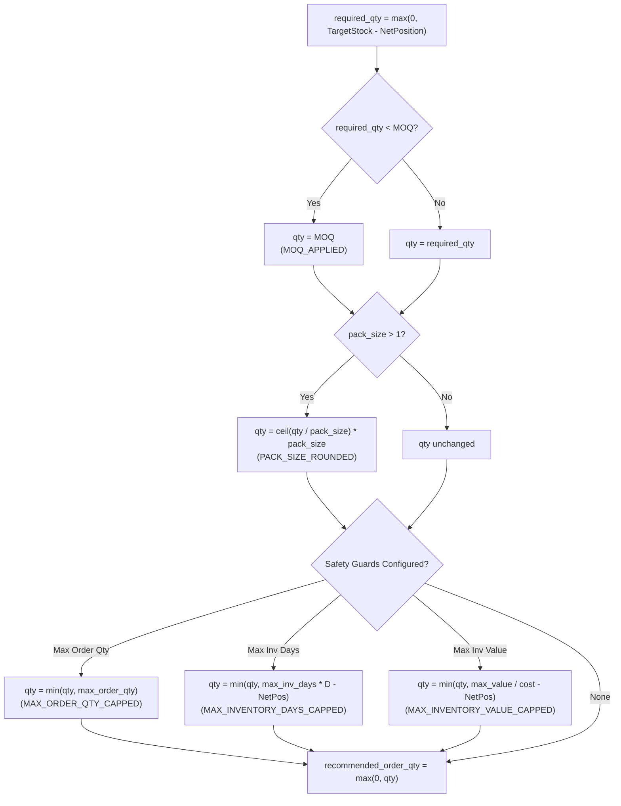

# Replenishment Engine & Sizing Solver (Phase 4B-1)

## 1. Overview & Architectural Principles

The **Replenishment Solver** is the execution engine of the Prescriptive Layer (Tier 4). It evaluates SKU × warehouse inventory states, determines whether replenishment is required, and calculates exact, orderable purchase quantities.

### Architectural Rules
1. **Deterministic & Explainable**: Every replenishment calculation is deterministic and transparent. No opaque heuristics, probabilistic guessing, or generative LLMs are used to formulate quantities or rationales.
2. **Reuses Phase 4A Intelligence**: The solver directly consumes Phase 4A inventory positions, lead times, safety stocks, dynamic reorder points (ROP), and risk classifications. It never duplicates upstream calculations.
3. **Strict Non-Hallucination**: If essential policy inputs (such as `target_stock_level` or `unit_cost`) are missing, the engine records an `INSUFFICIENT_POLICY_INPUTS` state or sets the cost to `None` rather than fabricating values.
4. **Dormant Stock Protection**: Dormant and zero-demand items are strictly prevented from generating replenishment orders, safeguarding enterprise working capital from dead stock accumulation.
5. **Separation of Concerns**: Phase 4B-1 calculates *unconstrained and constrained item-level replenishment quantities*. Vendor purchase order grouping, containerization, and minimum spend aggregation belong to Phase 4B-2, while multi-echelon network transfers belong to Phase 4C.

---

## 2. Replenishment Trigger Logic

### 2.1 Primary Trigger
For active catalog items, the primary replenishment condition is:

$$\text{Net Inventory Position} \le \text{Reorder Point (ROP)}$$

Where:
$$\text{Net Inventory Position} = \text{On-Hand} + \text{On-Order (Open Inbound)} - \text{Reserved (Allocated)}$$

### 2.2 Category & Demand State Differentiation
The solver categorizes items into active vs. dormant states before evaluating trigger thresholds:

| Inventory State | Trigger Condition | Recommendation Required? | Sizing Behavior |
| :--- | :--- | :---: | :--- |
| **`CRITICAL_STOCKOUT`** | Active demand AND ($\text{Net Position} \le 0$ OR $\text{On-Hand} \le 0$) | **Yes** | Sized to target stock level; urgency set to `CRITICAL`. |
| **`UNDERSTOCK`** | Active demand AND $\text{Net Position} \le \text{ROP}$ | **Yes** | Sized to target stock level; urgency set to `HIGH` or `MEDIUM`. |
| **`HEALTHY`** | Active demand AND $\text{Net Position} > \text{ROP}$ | **No** | Quantity = 0; urgency set to `LOW`. |
| **`OVERSTOCK`** | Active demand AND $\text{DOS} > \text{overstock\_threshold}$ | **No** | Quantity = 0; urgency set to `LOW`. |
| **`DEAD_STOCK`** | Zero or negligible demand ($\le \text{min\_demand\_threshold}$) | **No** | **Suppressed**; no replenishment generated. |

---

## 3. Quantity Sizing: Shortfall vs. Required vs. Recommended

The solver strictly distinguishes between three related quantity concepts:

```
+---------------------------------------------------------------+
| 1. Shortfall Quantity (Diagnostic Gap)                        |
|    shortfall_qty = max(0, ceil(ROP - NetPosition))            |
+---------------------------------------------------------------+
                               |
                               v
+---------------------------------------------------------------+
| 2. Required Quantity (Unconstrained Deficit to Target)        |
|    required_qty = max(0, ceil(TargetStock - NetPosition))     |
+---------------------------------------------------------------+
                               |
                               v
+---------------------------------------------------------------+
| 3. Recommended Order Quantity (Orderable Batch)              |
|    recommended_order_qty = ApplyConstraints(required_qty)   |
|    [MOQ -> Pack Size Rounding -> Max Guards & Caps]          |
+---------------------------------------------------------------+
```

### 3.1 Shortfall Quantity (`shortfall_qty`)
- **Definition**: The minimum units needed to bring net position back to the reorder point.
- **Formula**:
  $$\text{shortfall\_qty} = \max(0, \lceil \text{ROP} - \text{Net Position} \rceil)$$
- **Role**: Diagnostic visibility into how severely inventory has breached the safety buffer.

### 3.2 Required Quantity (`required_qty`)
- **Definition**: The unconstrained deficit required to restore inventory to the target stock level $S$.
- **Formula**:
  $$\text{required\_qty} = \max(0, \lceil \text{Target Stock Level} - \text{Net Position} \rceil)$$
- **Handling Negative Positions**: When customer backorders or reserved allocations exceed physical stock ($\text{Net Position} < 0$), the negative balance is naturally added to the order requirement.

### 3.3 Target Stock Level Policy
Target stock level $S$ is established in Phase 4A:
$$S = \text{ROP} + (D \times \text{review\_period\_days})$$
If $S$ is unavailable or undefined:
- `recommendation_required = True`
- `status = "INSUFFICIENT_POLICY_INPUTS"`
- `recommended_order_qty = 0`
- The system alerts planners rather than fabricating a replenishment batch size.

---

## 4. Supply Constraints & Safety Guards

Once unconstrained `required_qty` is determined, the solver evaluates physical and financial constraints in strict operational order:



### 4.1 Minimum Order Quantity (MOQ)
- Sourced from `Supplier.minimum_order_quantity` or `ReplenishmentConfig.sku_moq_overrides`.
- If $\text{required\_qty} > 0$ and $\text{required\_qty} < \text{MOQ}$, order quantity is raised to $\text{MOQ}$.
- Audit tag applied: `MOQ_APPLIED`.

### 4.2 Pack / Lot Size Rounding
- Sourced from `Product.pack_size`, `ReplenishmentConfig.sku_pack_sizes`, or global default.
- If $\text{pack\_size} > 1$, order quantity is rounded **UP** to the nearest integer multiple:
  $$\text{order\_qty} = \left\lceil \frac{\text{order\_qty}}{\text{pack\_size}} \right\rceil \times \text{pack\_size}$$
- Audit tag applied: `PACK_SIZE_ROUNDED`.

### 4.3 Maximum Order Guards & Caps
To prevent catastrophic over-ordering due to upstream spikes or data anomalies, optional safety caps are enforced:
1. **Maximum Order Quantity**:
   $$\text{order\_qty} \le \text{maximum\_order\_quantity}$$
   Audit tag: `MAX_ORDER_QTY_CAPPED`.
2. **Maximum Inventory Days**:
   $$\text{order\_qty} \le \max(0, \lfloor \text{maximum\_inventory\_days} \times D - \text{Net Position} \rfloor)$$
   Audit tag: `MAX_INVENTORY_DAYS_CAPPED`.
3. **Maximum Inventory Value**:
   $$\text{order\_qty} \le \max\left(0, \left\lfloor \frac{\text{maximum\_inventory\_value}}{\text{unit\_cost}} \right\rfloor - \text{Net Position}\right)$$
   Audit tag: `MAX_INVENTORY_VALUE_CAPPED`.

---

## 5. Deterministic Urgency Classification

Replenishment urgency is assigned via four deterministic tiers:

| Urgency Tier | Activation Criteria | Operational Action |
| :--- | :--- | :--- |
| **`CRITICAL`** | Active demand AND ($\text{Net Position} \le 0$ OR Phase 4A $\text{risk\_category} == \text{CRITICAL\_STOCKOUT}$) | Expedited purchase order placement; potential air freight or supplier priority lane. |
| **`HIGH`** | $\text{Net Position} \le \text{ROP}$ AND projected runout occurs within lead time ($\text{days\_to\_runout} \le L$) | Immediate purchase order generation in standard replenishment cycle. |
| **`MEDIUM`** | $\text{Net Position} \le \text{ROP}$ AND $\text{days\_to\_runout} > L$ | Standard purchase order queue; covered for immediate horizon but requires replenishment. |
| **`LOW`** | $\text{Net Position} > \text{ROP}$ OR dormant demand | No purchase order required; routine monitoring. |

---

## 6. Financial Valuation

The financial commitment for each recommendation is computed directly from physical product master data:

$$\text{estimated\_order\_cost} = \text{recommended\_order\_qty} \times \text{unit\_cost}$$

- **Non-Hallucination Rule**: If `unit_cost` is unavailable or `None`, `estimated_order_cost` is set to `None`. The system never assumes zero cost or invents prices.
- **Future Extension**: Revenue protection and gross-margin-at-risk valuations are handled in the subsequent financial optimization phase.

---

## 7. Deterministic Explainable Rationale

Every recommendation produces a deterministic natural-language rationale explaining the operational rationale and every constraint applied:

**Example 1 (MOQ & Pack Size Applied)**:
> *"Net inventory position is 40 units, at or below reorder point of 100.0 units. Forecast demand is 10.00 units/day with supplier lead time of 7.0 days. Target stock level is 200.0 units (unconstrained required: 160 units). Recommended order quantity is 200 units after applying supplier MOQ of 100 units, pack size multiple of 50 units. Urgency is HIGH with projected stockout in 4.0 days, before normal lead time (7.0 days)."*

**Example 2 (Dormant Item Suppressed)**:
> *"Item SKU_DORMANT at warehouse WH_01 has dormant forecast demand (0.00 units/day) with risk category 'DEAD_STOCK'. Replenishment is suppressed to avoid dead stock and working capital lockup."*

---

## 8. Portfolio Solver Usage

```python
from commerce_ai.inventory.service import InventoryService
from commerce_ai.recommendations.replenishment import ReplenishmentSolver, ReplenishmentConfig

# 1. Run Phase 4A Inventory Analysis
inv_service = InventoryService()
analysis = inv_service.analyze_portfolio(
    sales=sales_df,
    inventory=inventory_df,
    products=products_df,
    suppliers=suppliers_df,
    purchases=purchases_df,
)

# 2. Configure Replenishment Solver
solver = ReplenishmentSolver(
    config=ReplenishmentConfig(
        maximum_order_quantity=5000,
        maximum_inventory_days=90.0,
    )
)

# 3. Solve Portfolio Replenishment
result = solver.solve(
    inventory_analysis=analysis,
    products=products_df,
    suppliers=suppliers_df,
)

# Access actionable recommendations
for rec in result.actionable_recommendations:
    print(f"{rec.sku_id} @ {rec.warehouse_id}: Order {rec.recommended_order_qty} units (Urgency: {rec.urgency})")
    print(f"  Rationale: {rec.rationale}")

# Export to flat DataFrame
recommendations_df = result.to_dataframe()
```

---

## 9. Limitations & Phase 4B-2 Roadmap

1. **Item-Level Evaluation**: Phase 4B-1 evaluates SKU × warehouse entities independently. Phase 4B-2 will introduce **PO Proposal Generation**, grouping multiple line items by supplier, enforcing vendor minimum spend thresholds (e.g. $10,000 order minimum), and consolidating containers.
2. **Deterministic Target Stock**: Sizing currently uses order-up-to target stock levels. Advanced dynamic target stock tuning via continuous cost-benefit optimization will be added in subsequent prescriptive layers.
3. **No Inter-Warehouse Transfers**: Warehouse deficits are currently resolved via supplier replenishment. Phase 4C will introduce lateral transshipments and network rebalancing before purchase orders are issued.
