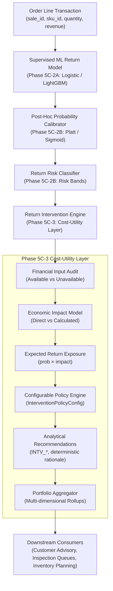

# Return Intervention / Cost-Utility Engine (Phase 5C-3)

This document specifies the architecture, financial modeling, economic exposure formulations, decision logic, and portfolio aggregation for the deterministic **Return Intervention / Cost-Utility Engine** in the Commerce AI platform.

---

> [!IMPORTANT]
> **Prototype Policy Notice**:
> This engine is an **analytical prototype policy layer** and is **not a business-approved intervention policy**.
> Production deployment requires business stakeholder validation of real return logistics costs, refund policies, margin definitions, intervention effectiveness, and customer relationship management policies.

---

## 1. Purpose & Objective

In Phase 5C-2B, calibrated return probabilities and risk bands were computed to answer:
*"What is the true empirical probability that an order line will be returned?"*

Phase 5C-3 answers the downstream business question:
> *"For an order line with an estimated probability of return, is there enough financial and business evidence to justify an operational intervention?"*

The conceptual decision pipeline is:
$$\text{Order Line} \longrightarrow \text{Calibrated Probability} \longrightarrow \text{Financial Inputs} \longrightarrow \text{Estimated Return Cost / Impact} \longrightarrow \text{Intervention Economics} \longrightarrow \text{Business Policy} \longrightarrow \text{Recommendation}$$

The engine explicitly distinguishes between:
1. **Sufficient Financial Evidence**: Core transaction economics and reverse logistics costs are observed or reliably parameterized.
2. **Insufficient Financial Evidence**: Critical revenue, cost, or probability values are missing or malformed.
3. **Economically Meaningful Opportunity**: Elevated return probability combined with material monetary loss exposure exceeding policy thresholds.
4. **No Intervention Indicated**: Low probability of return or negligible financial impact.

---

## 2. Architecture & Pipeline Positioning



### Architectural Guardrails
- **Informational Output Only**: Does not create purchase orders, execute warehouse transfers, modify prices, trigger automated refund holds, or block customers.
- **No Autonomous Execution**: Emits structured, auditable decision records (`ReturnInterventionRecommendation`) for downstream planning.
- **Deterministic ID Generation**: All recommendations receive reproducible SHA-256 identifiers derived from transaction keys and policy versions.
- **No AI / LLM Generation**: All rationales are generated deterministically using parameterized templates.

---

## 3. Financial Input Availability Assessment

In strict accordance with the project's data contract principles, the engine relies exclusively on fields observed in the canonical data schema:

### 3.1 Observed Financial Fields
| Source Dataset | Available Field Name | Description | Role in Financial Model |
| :--- | :--- | :--- | :--- |
| `sales.csv` | `quantity` | Sold units on order line | Direct Multiplier |
| `sales.csv` | `unit_price` | Unit selling price at checkout | Direct Input |
| `sales.csv` | `discount` | Promotional discount applied | Direct Input |
| `sales.csv` | `revenue` | Net realized revenue ($q \cdot p - d$) | Direct Base |
| `sales.csv` | `currency` | Currency denomination (USD) | Currency Context |
| `products.csv` | `unit_cost` | Standard procurement / manufacturing cost | Cost of Goods Base |
| `products.csv` | `selling_price` | Catalog list price | Reference Base |

### 3.2 Unavailable Financial Fields (Not in Canonical Data)
The following reverse logistics and operational return cost fields **do not exist** in the raw transactional tables:
- `return_shipping_cost`: Inbound return carrier freight.
- `handling_cost` / `processing_cost`: Receiving facility labor and scanning.
- `inspection_cost`: Return triage and defect grading labor.
- `restocking_cost`: Put-away and inventory re-slotting cost.
- `salvage_value`: Secondary liquidation recovery value for open-box or damaged items.
- `refund_amount`: Specific monetary refund amount (only return `quantity` and `reason` are tracked in `returns.csv`).

> [!NOTE]
> The engine **never manufactures fake values** for unavailable fields. If return-specific costs are missing, the engine records them explicitly in `missing_inputs` and handles them transparently via policy configuration.

---

## 4. Financial & Economic Formulas

The engine distinguishes between directly observed inputs, derived accounting metrics, and economic exposure calculations:

### 4.1 Core Order Economics (Derived)
1. **Gross Revenue**:
   $$\text{gross\_revenue} = \text{quantity} \times \text{unit\_price}$$
2. **Net Revenue**:
   $$\text{revenue} = \text{gross\_revenue} - \text{discount}$$
3. **Estimated Product Cost (Cost of Goods Sold)**:
   $$\text{estimated\_product\_cost} = \text{quantity} \times \text{unit\_cost}$$
4. **Estimated Gross Margin**:
   $$\text{estimated\_gross\_margin} = \text{revenue} - \text{estimated\_product\_cost}$$

### 4.2 Reverse Logistics & Return Impact Modeling
When return-specific cost inputs are available (either on the transaction record or injected via policy defaults):
1. **Estimated Return Cost**:
   $$\text{estimated\_return\_cost} = \text{return\_shipping\_cost} + \text{handling\_cost} + \text{restocking\_cost}$$
2. **Estimated Return Impact**:
   - Under the standard `item_revenue` model:
     $$\text{estimated\_return\_impact} = \text{revenue} + \text{estimated\_return\_cost} - \text{salvage\_value}$$
   - Under the conservative `gross_margin` model:
     $$\text{estimated\_return\_impact} = \max(0.0, \text{estimated\_gross\_margin}) + \text{estimated\_return\_cost}$$

### 4.3 Expected Return Exposure
$$\text{expected\_return\_exposure} = \text{calibrated\_return\_probability} \times \text{estimated\_return\_impact}$$

---

## 5. Completeness Classifications & Missing-Data Behavior

Every evaluated order line is assigned a [`FinancialInputStatus`](file:///c:/Users/avijeet.jaiswal/Documents/GitHub/Project/eRetail-AI-Intelligence/src/commerce_ai/returns/schemas.py#L944-L950):

| Status Code | Definition | Missing Inputs Present? | Outcome When Policy is Non-Strict | Outcome When Policy is Strict |
| :--- | :--- | :---: | :--- | :--- |
| `SUFFICIENT` | Core economics AND explicit return costs are observed. | None | Evaluates exposure & decision | Evaluates exposure & decision |
| `PARTIAL` | Core economics observed; return-specific costs unobserved. | `["return_shipping_cost", "handling_cost", ...]` | Uses net revenue as proxy for return impact | Emits `INSUFFICIENT_DATA` |
| `INSUFFICIENT` | Missing `quantity`, `revenue`, or `unit_cost`. | `["revenue", "unit_cost", ...]` | Emits `INSUFFICIENT_DATA` | Emits `INSUFFICIENT_DATA` |
| `INSUFFICIENT_FINANCIAL_INPUTS` | Missing critical fields prevent economic evaluation. | Explicit field list | Emits `INSUFFICIENT_DATA` | Emits `INSUFFICIENT_DATA` |

---

## 6. Configurable Intervention Policy (`InterventionPolicyConfig`)

Business logic is isolated in [`InterventionPolicyConfig`](file:///c:/Users/avijeet.jaiswal/Documents/GitHub/Project/eRetail-AI-Intelligence/src/commerce_ai/returns/schemas.py#L967-L1010):

```python
class InterventionPolicyConfig(BaseModel):
    policy_version: str = "1.0.0-prototype"
    minimum_probability: float = 0.20          # 20% return probability floor
    minimum_expected_exposure: float = 25.0    # $25 expected loss floor
    high_exposure_threshold: float = 75.0      # $75 threshold for high-value alerts
    minimum_margin_at_risk: float = 0.0        # Optional margin guard
    require_return_costs: bool = False         # Enforce strict return cost availability
    default_return_shipping_cost: Optional[float] = None
    default_handling_cost: Optional[float] = None
    default_restocking_cost: Optional[float] = None
    return_cost_model: str = "item_revenue"    # 'item_revenue' or 'gross_margin'
```

### Decision Matrix
| Condition | Decision Outcome | Recommendation Code | Rationale Description |
| :--- | :--- | :--- | :--- |
| Missing/invalid probability | `INSUFFICIENT_DATA` | `INSUFFICIENT_PROBABILITY_DATA` | Calibrated probability missing or out of $[0, 1]$ |
| Missing revenue or unit cost | `INSUFFICIENT_DATA` | `INSUFFICIENT_FINANCIAL_INPUTS` | Financial inputs insufficient for exposure calculation |
| Missing return costs (strict) | `INSUFFICIENT_DATA` | `INSUFFICIENT_FINANCIAL_INPUTS` | Return-specific cost inputs missing |
| Negative gross margin ($< 0$) | `REVIEW_REQUIRED` | `NEGATIVE_MARGIN_REVIEW` | Product exhibits commercial loss before return |
| $p < p_{\min}$ ($20\%$) | `NO_INTERVENTION_INDICATED` | `NO_INTERVENTION_INDICATED` | Return probability is below intervention floor |
| $p \ge p_{\min}$ but $\text{Exposure} < \$25$ | `NO_INTERVENTION_INDICATED` | `NO_INTERVENTION_INDICATED` | Elevated probability but sub-threshold loss |
| $p \ge p_{\min}$ and $\$25 \le \text{Exposure} < \$75$ | `INTERVENTION_INDICATED` | `REVIEW_RETURN_RISK` | Elevated return risk with meaningful loss |
| $p \ge p_{\min}$ and $\text{Exposure} \ge \$75$ | `INTERVENTION_INDICATED` | `REVIEW_HIGH_VALUE_RETURN_EXPOSURE` | Elevated return risk with major financial loss |

---

## 7. Deterministic Non-Causal Rationales

In compliance with audit standards, all rationales are deterministic and non-causal:
- **Low Risk**: `"Return probability is below the configured intervention threshold."`
- **Sub-threshold Exposure**: `"Return probability is elevated (30.0%), but expected return exposure ($15.00) is below the economic intervention threshold ($25.00)."`
- **Intervention Indicated**: `"Return probability is elevated (25.0%) and expected return exposure ($50.00) exceeds the configured policy threshold ($25.00)."`
- **High-Value Exposure**: `"Return probability is elevated (35.0%) and expected return exposure ($105.00) exceeds the high-value policy threshold ($75.00)."`
- **Missing Return Costs**: `"Return probability is available, but return-specific cost inputs are missing."`
- **Missing Financials**: `"Financial inputs are insufficient to calculate expected return exposure."`
- **Negative Margin**: `"Product exhibits negative gross margin (-$20.00); manual commercial and return risk review required."`

---

## 8. Portfolio Aggregation & Reporting

The [`PortfolioInterventionSummary`](file:///c:/Users/avijeet.jaiswal/Documents/GitHub/Project/eRetail-AI-Intelligence/src/commerce_ai/returns/schemas.py#L1065-L1110) aggregates batch or network-level evaluations:

### Key Rollup Metrics
- Total order lines analyzed
- Sufficient, partial, and insufficient data counts
- Counts by decision: `INTERVENTION_INDICATED`, `NO_INTERVENTION_INDICATED`, `REVIEW_REQUIRED`, `INSUFFICIENT_DATA`
- Total revenue represented ($\sum \text{revenue}$)
- Total estimated return impact ($\sum \text{impact}$)
- Total expected return exposure ($\sum \text{exposure}$)
- Multi-dimensional breakdowns:
  - By SKU
  - By Channel
  - By Warehouse
  - By Risk Band

### Distinction of Missing Values
> [!IMPORTANT]
> **Missing Values are NOT Zero**:
> If an order line lacks return cost or revenue, the metric is excluded from the sum. If **all** records lack a metric, the portfolio total is emitted as `None` (not `$0.00$`). This prevents unobserved costs from being misrepresented as zero-cost transactions.

---

## 9. Data Quality & Edge Case Handling

1. **Duplicate Sale Identifiers**: If duplicate `sale_id` values appear within the same evaluation cohort, duplicate rows are flagged as `DATA_QUALITY_ERROR` to prevent double-counting.
2. **Point-in-Time Leakage**: If an `as_of_date` is specified and a record date exceeds the cutoff date, it is rejected with `DATA_QUALITY_ERROR` and a future-leakage rationale.
3. **Invalid Quantities and Prices**: Non-positive quantities ($q \le 0$), negative prices ($p < 0$), or negative revenue ($r < 0$) are rejected without silent repair.
4. **Invalid Probability Values**: Values outside $[0.0, 1.0]$, NaNs, or infinities are rejected.
5. **Zero Revenue**: Validated orders with $100\%$ discounts or free samples yield $\$0.00$ exposure and evaluate to `NO_INTERVENTION_INDICATED`.

---

## 10. Limitations & Production Requirements

### 10.1 Analytical Limitations
1. **Unobserved Reverse Freight**: Without actual WMS/carrier settlement data, return shipping costs are unobserved in the canonical dataset.
2. **Non-Causal Intervention**: Identifying an order line with elevated expected return exposure does not guarantee that contacting the customer or offering sizing support will prevent the return.
3. **Uniform Return Rates**: Returns are evaluated at the order-line grain without customer-level bracketing history.

### 10.2 Requirements Before Production Deployment
Before deploying this engine to trigger live operational actions, enterprise operators must validate:
1. **Contracted Carrier Rates**: Ingest real reverse-logistics shipping tables by origin/destination zone.
2. **WMS Processing Costs**: Measure empirical handling and grading labor by product category.
3. **Restocking & Salvage Rates**: Ingest liquidation recovery percentages for damaged items.
4. **Intervention Efficacy Studies**: Conduct randomized A/B trials to verify whether digital sizing prompts or proactive customer outreach actually reduce return rates without hurting customer satisfaction.
5. **Formal Executive Policy**: Replace prototype configuration thresholds with formal finance-approved ROI cutoffs.
