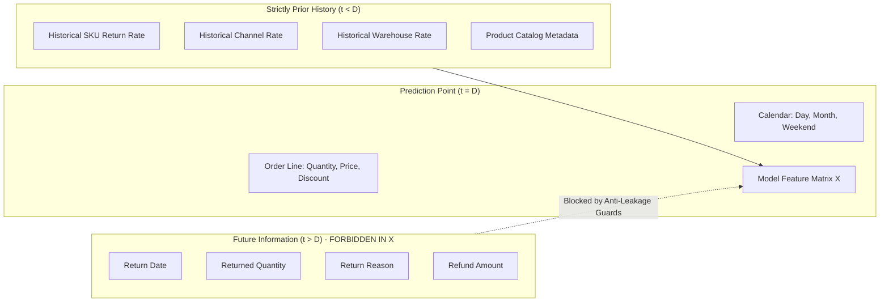

# Phase 5C-1: Return Prediction Dataset & Label Engineering

## 1. Executive Summary & Objective

The **Return Prediction Dataset & Label Engineering Engine** (Phase 5C-1) prepares the supervised-learning dataset for predictive tabular modeling of customer returns.

The engine establishes:
- The precise, non-synthetic prediction unit of observation (**Order Line**).
- A leakage-free historical binary label indicating whether a purchased order line was subsequently returned within an established policy window.
- Strict point-in-time historical feature extraction guaranteeing zero future lookahead.
- Deterministic, non-random chronological temporal splits for model validation.
- Comprehensive data quality, referential integrity, and target imbalance auditing.

> [!IMPORTANT]
> **Model Boundary Confirmation**: Phase 5C-1 strictly builds and verifies the tabular feature matrix and target. No machine learning models (LightGBM, Logistic Regression, etc.) are trained in this phase.

---

## 2. Actual Data Inspection & Prediction Grain

### 2.1 Inspection of Canonical Data Contracts
Inspection of `sales`, `returns`, and catalog entities reveals:
- **Sales Primary Key**: `sale_id`.
- **Order Grouping**: `order_id` links transaction lines together.
- **Sales Granularity**: Each row represents an individual line item specifying `sku_id`, `warehouse_id`, `channel_id`, `quantity`, `unit_price`, and `revenue`.
- **Returns Linkage**: The returns contract contains `return_id`, `order_id`, `sku_id`, `warehouse_id`, `quantity`, `reason`, and `channel_id`. Returns link back to sales via the natural composite key `(order_id, sku_id)`.

### 2.2 Selected Prediction Grain
```text
prediction_grain: order_line (sale_id / order_id × sku_id)
```
Each row in the prediction dataset corresponds to a single fulfilled order line that could have been scored at order creation / fulfillment time.

---

## 3. Label Engineering & Return Window Policy

### 3.1 Target Definition
The primary prediction target is binary:
$$y \in \{0, 1\}$$
- $y = 1$: The customer returned units from this order line within the return window.
- $y = 0$: No units from this order line were returned within the return window.

### 3.2 Partial Return Policy
When a customer orders multiple units and returns a subset (e.g., sold quantity = 10, returned quantity = 3):
- The binary classification target is defined as **`target_returned = 1`** (the transaction was return-positive).
- Auxiliary metadata records **`target_return_quantity = 3`** and the return proportion for continuous or cost-weighted downstream analysis.

### 3.3 Return Window Formulation
A return event is assigned a positive label if and only if:
$$0 \le (\text{return\_date} - \text{sale\_date}) \le \text{return\_window\_days}$$
- **Default Window**: 30 calendar days (configurable via `ReturnPredictionConfig.return_window_days`).
- **Lag Distribution**: In synthetic and empirical ecommerce baselines, return lag follows an asymmetric right-skewed distribution, typically peaking between 3 and 15 days.
- **Post-Window Returns**: Returns processed after `return_window_days` are classified as $y = 0$ (or audited as policy exceptions).

### 3.4 Handling Immature Orders (Right Censoring)
Orders placed within `return_window_days` of the latest dataset date have not completed their full eligibility window. Unreturned orders in this buffer are immature. The builder provides a configurable cutoff policy (`exclude_immature` vs `include_all`) to prevent injecting artificial false negatives into the training set.

---

## 4. Strict Point-in-Time Protection & Feature Engineering

Features are computed using **only** information available at the exact prediction timestamp (order creation date $D$).



### 4.1 Engineered Feature Catalog
| Feature Name | Data Type | Source | Calculation | Leakage Protection |
| :--- | :--- | :--- | :--- | :--- |
| `quantity` | `int` | `sales` | Sold order-line quantity | Known at checkout |
| `unit_price` | `float` | `sales` | Realized unit price | Fixed at transaction |
| `discount` | `float` | `sales` | Applied promotional discount | Fixed at transaction |
| `discount_rate` | `float` | `sales` | `discount / (quantity * unit_price)` | Fixed at transaction |
| `revenue` | `float` | `sales` | Net realized revenue | Fixed at transaction |
| `channel_id` | `category` | `sales` | Sales channel code | Known at checkout |
| `warehouse_id` | `category` | `sales` | Fulfillment facility code | Assigned at routing |
| `category_id` | `category` | `products` | Product merchandise category | Catalog master |
| `brand` | `category` | `products` | Commercial brand | Catalog master |
| `unit_cost` | `float` | `products` | Standard landed cost | Pre-order master |
| `selling_price` | `float` | `products` | Standard retail price | Catalog master |
| `gross_margin_rate`| `float` | `products` | `(selling_price - unit_cost) / selling_price` | Pre-order master |
| `velocity_tier` | `category` | `products` | Catalog sales velocity tier | Pre-order master |
| `day_of_week` | `int` | `calendar` | Day of week (0=Mon, 6=Sun) | Deterministic calendar |
| `day_of_month` | `int` | `calendar` | Day of month (1-31) | Deterministic calendar |
| `month` | `int` | `calendar` | Month (1-12) | Deterministic calendar |
| `quarter` | `int` | `calendar` | Quarter (1-4) | Deterministic calendar |
| `is_weekend` | `int` | `calendar` | 1 if Saturday or Sunday, else 0 | Deterministic calendar |
| `hist_sku_return_rate` | `float` | `history` | Prior SKU returned units / sold units | Filtered strictly $< D$ |
| `hist_sku_sold_units` | `int` | `history` | Cumulative SKU sold units | Filtered strictly $< D$ |
| `hist_sku_returned_units`| `int` | `history` | Cumulative SKU returned units | Filtered strictly $< D$ |
| `hist_channel_return_rate`| `float` | `history` | Prior channel return rate | Filtered strictly $< D$ |
| `hist_warehouse_return_rate`| `float` | `history` | Prior warehouse return rate | Filtered strictly $< D$ |
| `hist_sku_channel_return_rate`| `float` | `history` | Prior (SKU, Channel) return rate | Filtered strictly $< D$ |
| `hist_sku_warehouse_return_rate`| `float` | `history` | Prior (SKU, Warehouse) return rate | Filtered strictly $< D$ |
| `is_cold_start_sku` | `int` | `history` | 1 if prior SKU sold units $< 10$, else 0 | Filtered strictly $< D$ |
| `is_cold_start_channel` | `int` | `history` | 1 if prior channel sold units $< 10$, else 0| Filtered strictly $< D$ |
| `is_cold_start_combination` | `int` | `history` | 1 if prior (SKU, Channel) units $< 10$, else 0| Filtered strictly $< D$ |

---

## 5. Cold-Start Fallback Hierarchy

When scoring newly launched SKUs, new channels, or sparse combinations:
$$\text{SKU} \times \text{Channel History} \xrightarrow[\text{units} < 10]{} \text{SKU History} \xrightarrow[\text{units} < 10]{} \text{Category History} \xrightarrow[\text{units} < 10]{} \text{Global Baseline Rate}$$

Explicit cold-start binary indicators (`is_cold_start_sku`, `is_cold_start_channel`, `is_cold_start_combination`) are provided directly to tree-based algorithms to learn cold-start behavior patterns.

---

## 6. Chronological Temporal Splitting

To prevent lookahead leakage in validation, random cross-validation or random train-test splitting is **strictly forbidden**.

Dataset records are sorted chronologically by `date` (and `sale_id`):
```text
[----------------- Train (70%) -----------------][-- Val (15%) --][-- Test (15%) --]
Earliest Dates                                                      Latest Dates
```
- No record in `Train` has a date greater than any record in `Val`.
- No record in `Val` has a date greater than any record in `Test`.
- All three index subsets are mutually disjoint.

---

## 7. Data Quality & Referential Auditing

`ReturnPredictionQualityReport` automatically audits and flags:
- Duplicate `sale_id` records
- Missing or unparseable sales dates
- Missing `order_id` or `sku_id`
- Non-positive quantities or negative unit prices
- Referential integrity breaks (SKU not in products, warehouse not in warehouses, channel not in channels)
- Impossible return events ($\text{return\_date} < \text{sale\_date}$ or $\text{return\_quantity} > \text{sold\_quantity}$)
- Unmapped returns (return with no matching sales order)

---

## 8. Forbidden Features Validation

`ReturnPredictionDataset.verify_no_leakage()` runs an explicit assertion verifying that none of the following column substrings exist in feature matrix `X`:
```python
FORBIDDEN_LEAKAGE_COLUMNS = {
    "return_date", "returned_quantity", "return_quantity", "return_reason",
    "reason", "refund_amount", "refund", "target_returned",
    "target_return_quantity", "target_return_date", "return_id", "lag_days", "is_returned"
}
```

---

## 9. Python Usage Example

```python
import pandas as pd
from commerce_ai.returns import (
    ReturnPredictionConfig,
    ReturnPredictionDatasetBuilder,
)

# 1. Configure dataset parameters
config = ReturnPredictionConfig(
    return_window_days=30,
    prediction_cutoff_policy="exclude_immature",
    temporal_train_ratio=0.70,
    temporal_validation_ratio=0.15,
    temporal_test_ratio=0.15,
)

# 2. Build dataset from operational tables
builder = ReturnPredictionDatasetBuilder(config=config)
dataset = builder.build(
    sales=sales_df,
    returns=returns_df,
    products=products_df,
    warehouses=warehouses_df,
    channels=channels_df,
)

# 3. Retrieve temporal splits cleanly separated into X and y
X_train, y_train = dataset.get_train_data()
X_val, y_val = dataset.get_val_data()
X_test, y_test = dataset.get_test_data()

# 4. Check class balance
imbalance = dataset.get_imbalance_stats()
print(f"Total Rows: {imbalance['total_count']}")
print(f"Positive Rate: {imbalance['positive_rate']:.2%}")

# 5. Review data quality report
print(f"Dataset Clean: {dataset.quality_report.is_clean}")
if not dataset.quality_report.is_clean:
    print(dataset.quality_report.issues)
```

---

## 10. Future Model Training (Phase 5C-2 Roadmap)

This dataset directly prepares the tabular feature matrix for Phase 5C-2:
1. **Model Baseline**: Logistic Regression with standardized numericals and one-hot encoded categoricals.
2. **Primary Benchmark**: LightGBM Classifier with native categorical handling.
3. **Evaluation Protocol**: Evaluated strictly on the chronological holdout `Test` split using PR-AUC, ROC-AUC, Precision, Recall, and Brier score calibration.
4. **TimesFM Clarification**: TimesFM is reserved for demand time-series forecasting (Phase 3) and is not utilized for tabular order-line return prediction.
