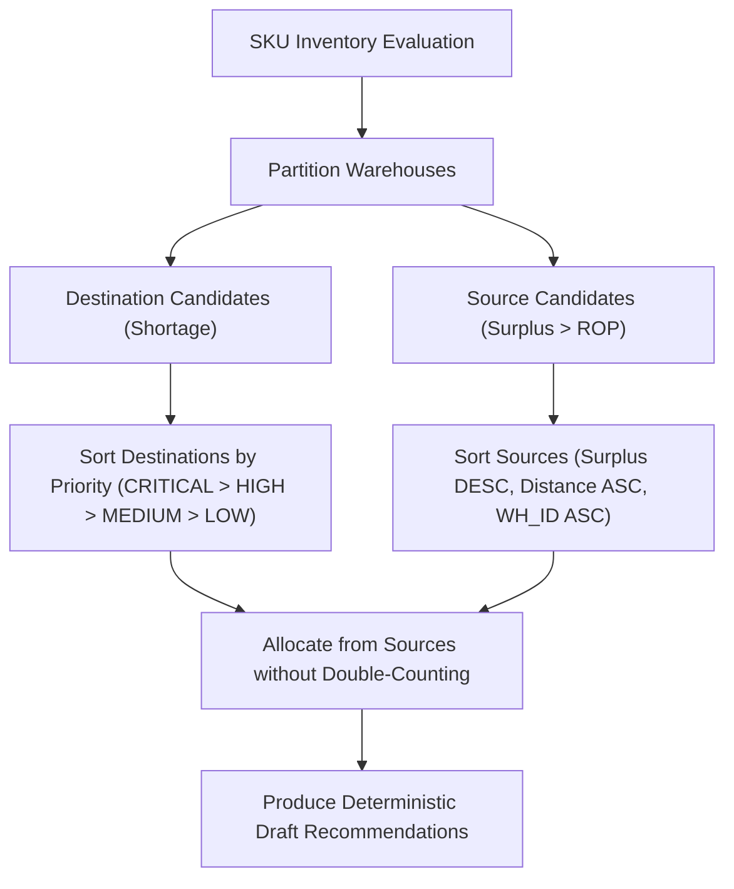

# Warehouse Rebalancing Engine (Phase 4C)

## 1. Overview & Purpose

The **Warehouse Rebalancing Engine** identifies opportunities to resolve inventory shortages and stockout risks at fulfillment warehouses by transferring surplus stock from peer warehouses across the distribution network. 

Instead of automatically purchasing additional stock from external suppliers, the engine answers the strategic fulfillment question:

> *"Can another warehouse in our network supply this warehouse before we need to purchase more inventory from external vendors?"*

### 1.1 Architectural Flow
```
Sales Transactions
  ↓
Demand Intelligence (Reconstruction, Stockout Masking, ABC/XYZ)
  ↓
Forecasting Service (Statistical, Machine Learning, TimesFM)
  ↓
Inventory Intelligence (Positions, Lead Times, Safety Stock, ROP, Risk)
  │
  ├──→ Replenishment Solver (Phase 4B-1) ──→ PO Proposal Engine (Phase 4B-2)
  │
  └──→ Warehouse Rebalancing (Phase 4C)  ──→ Transfer Recommendations (THIS MODULE)
                                                   ↓
                                             Human Review
                                                   ↓
                                             Future WMS / OMS Execution
```

### 1.2 Separation of Responsibilities

| Engine | Core Operational Question | Primary Output |
| :--- | :--- | :--- |
| **Replenishment Solver (Phase 4B-1)** | *"What quantity should we obtain from vendors?"* | `ReplenishmentRecommendation` |
| **Purchase Order Engine (Phase 4B-2)** | *"What draft vendor purchase orders should represent replenishment?"* | `PurchaseOrderProposal` |
| **Warehouse Rebalancing (Phase 4C)** | *"Can we satisfy shortage from peer warehouses without purchasing?"* | `WarehouseTransferRecommendation` |

The engines operate side-by-side. The rebalancing engine produces recommendations that a future decision layer can compare against supplier lead times and costs before authorizing transfers or purchase orders.

---

## 2. Core Concepts & Mathematical Formulations

### 2.1 Destination Warehouse Identification (Need)
A warehouse entity qualifies as an active destination candidate if it has an active inventory shortage:

$$\text{Net Inventory Position} \le \text{Reorder Point (ROP)}$$
$$\text{OR}$$
$$\text{Risk Category} \in \{\text{CRITICAL\_STOCKOUT}, \text{UNDERSTOCK}\}$$

#### Exclusions & Guards
1. **Dormant & Dead Stock Suppression**:
   - If destination daily demand $\le \text{min\_demand\_threshold}$ ($0.01$ units/day) or risk category is $\text{DEAD\_STOCK}$, it is **strictly excluded** from receiving inventory and recorded in `excluded_dormant`.
2. **Missing Policy Inputs**:
   - If $\text{target\_stock\_level}$ is missing/null, the warehouse cannot compute an order quantity and is recorded in `insufficient_policy_inputs` (`MISSING_TARGET_STOCK`).
   - If $\text{reorder\_point}$ is missing/null, the warehouse is recorded in `insufficient_policy_inputs` (`MISSING_REORDER_POINT`).
   - The engine **never** invents arbitrary targets or reorder points.

#### Destination Requirement Calculation
$$\text{Destination Required Quantity} = \max\left(0, \text{Target Stock Level} - \text{Net Inventory Position}\right)$$

---

### 2.2 Source Warehouse Identification & Protection
A warehouse qualifies as an available transfer source if its net inventory position exceeds its required protection level.

#### Source Protection Invariant
Source warehouses are protected at their dynamic Reorder Point ($\text{ROP}$):
$$\text{Protected Stock} = \text{Reorder Point}$$

#### Transferable Surplus
$$\text{Transferable Surplus} = \max\left(0, \text{Net Inventory Position} - \text{Protected Stock}\right)$$

> **CRITICAL RULE**: A transfer must never push a source warehouse's net inventory position below its protection level ($\text{ROP}$).
>
> *Example*: If Source has On-Hand = 500, ROP = 300 (Surplus = 200), and Destination requires 400, the maximum transfer allowed is **200**, leaving the source exactly at its protection level of 300.

---

### 2.3 Transfer Quantity & Constraints
The base transfer quantity is the minimum of available source surplus and destination requirement:

$$\text{Base Transfer Quantity} = \min\left(\text{Source Transferable Surplus}, \text{Destination Required Quantity}\right)$$

#### Constraints & Multiples
- **Transfer Pack Size**: If $\text{transfer\_pack\_size} > 1$, the quantity is rounded down to the nearest multiple so as never to exceed available surplus or destination requirement:
  $$\text{Transfer Quantity} = \left\lfloor \frac{\text{Base Transfer Quantity}}{\text{Pack Size}} \right\rfloor \times \text{Pack Size}$$
- **Maximum Transfer Quantity**: Caps single shipment sizes at $\text{maximum\_transfer\_quantity}$.
- **Minimum Transfer Quantity**: If $\text{transfer\_qty} < \text{minimum\_transfer\_quantity}$, the transfer is made only if both surplus and requirement can satisfy the minimum; otherwise, transfer is 0.0.
- **Supplier MOQ Independence**: Supplier vendor MOQs are strictly isolated to replenishment and never applied to internal warehouse transfers.

---

## 3. Allocation & Matching Logic

For every SKU across the multi-warehouse network:



### 3.1 Destination Priority Hierarchy
When multiple destinations compete for network surplus:
1. `CRITICAL`: $\text{Net Position} \le 0 \text{ OR } \text{Risk} = \text{CRITICAL\_STOCKOUT}$
2. `HIGH`: $\text{Risk} = \text{UNDERSTOCK}$ (or projected runout $\le$ transit lead time)
3. `MEDIUM`: $\text{Net Position} \le \text{ROP}$
4. `LOW`: Healthy / No transfer needed

*Tie-breakers*:
1. Higher required deficit ($\text{required\_qty}$)
2. Alphabetical `destination_warehouse_id`

### 3.2 Source Selection Priority
When a destination can receive inventory from multiple candidate sources:
1. **Same SKU**: Cross-SKU transfers are strictly prohibited.
2. **Highest Remaining Surplus**: Depletes largest excess positions first.
3. **Shortest Transfer Distance**: Shorter $\text{distance\_km}$ prioritized when distance data is available.
4. **Deterministic Tie-breaker**: Alphabetical `source_warehouse_id`. If distance is unavailable, geography is never fabricated.

### 3.3 Dynamic Non-Double-Allocation Tracking
To ensure source inventory is never promised to multiple destinations simultaneously, the engine dynamically decrements each source's available surplus as recommendations are formed:

$$\text{Remaining Surplus}_{\text{source}} \leftarrow \text{Remaining Surplus}_{\text{source}} - \text{Transfer Quantity}$$

Unsatisfied destination deficits are cleanly recorded in `unmet_destination_demand`.

---

## 4. Multi-Warehouse Example (Section 14 Scenario)

Consider **SKU-100** across three regional warehouses:

| Warehouse | Net Position | ROP | Target Stock | Risk State | Role | Calculated Metric |
| :--- | :--- | :--- | :--- | :--- | :--- | :--- |
| **WH-A** | 20 | 150 | 300 | `CRITICAL_STOCKOUT` | Destination | Needs $300 - 20 = 280$ |
| **WH-B** | 500 | 200 | 350 | `HEALTHY` | Source | Surplus $500 - 200 = 300$ |
| **WH-C** | 280 | 200 | 300 | `HEALTHY` | Source | Surplus $280 - 200 = 80$ |

### Allocation Execution:
1. **Destination WH-A** requires 280 units (Priority: `CRITICAL`).
2. **Sources available**: WH-B (surplus 300), WH-C (surplus 80).
3. **Selection**: WH-B is selected first due to higher surplus ($300 > 80$).
4. **Transfer Quantity**: $\min(300, 280) = 280$ units.
5. **Post-Transfer State**:
   - `WH-B` remaining surplus = 20 (leaving net position at 220, safely above its ROP of 200).
   - `WH-C` surplus remains untouched at 80.
   - `WH-A` remaining requirement = 0.
6. **Result**: A single recommendation `WH-B → WH-A: 280 units` is generated.

---

## 5. Traceability & Determinism

### 5.1 Deterministic Recommendation IDs
Recommendation IDs are 100% reproducible and use cryptographic SHA-256 digests over inputs:

$$\text{Digest} = \text{SHA256}\left(\text{sku\_id} \mid \text{src\_wh} \mid \text{dest\_wh} \mid \text{transfer\_qty} \mid \text{as\_of\_date}\right)[:8]$$
$$\text{ID} = \text{XFER\_}\{\text{sku\_id}\}\_\{\text{src\_wh}\}\_\{\text{dest\_wh}\}\_\{\text{Digest}\}$$

### 5.2 Deterministic Explanations (No LLM)
Every recommendation provides an audit-grade, explainable natural-language rationale:

> *"Warehouse WH-A has a net inventory position of 20 units against a target stock level of 300 units and is classified as CRITICAL_STOCKOUT. Warehouse WH-B has 500 units against a reorder point of 200 units, leaving 300 transferable units. A transfer of 280 units is recommended to cover WH-A's requirement while keeping WH-B at or above its reorder point."*

---

## 6. Financial Costs & Route Telemetry

- **Route Distance**: Exposes `distance_km` if provided via route tables or config; otherwise `None`.
- **Transit Lead Time**: Exposes `transfer_lead_time_days` if provided; otherwise `None`.
- **Transfer Cost**:
  $$\text{Estimated Transfer Cost} = \text{Transfer Quantity} \times \text{Transfer Cost Per Unit}$$
  If unit transfer cost is missing, `estimated_transfer_cost = None`.
- **Cost Data Status**:
  - `COMPLETE_COST_DATA`: All recommendations have explicit cost values.
  - `PARTIAL_COST_DATA`: Some recommendations have cost values while others are None.
  - `NO_COST_DATA`: No recommendations have cost values or result is empty.

---

## 7. Safety Guarantees & Constraints

1. **Recommendation-Only**: The engine **never** modifies live inventory, creates stock transfers, or calls WMS/OMS/ERP APIs.
2. **Draft Status Mandatory**: Every recommendation is emitted with `status = "DRAFT"`.
3. **Human Approval Mandatory**: Every recommendation is emitted with `approval_required = True`.
4. **Zero Hallucination / No LLM**: All allocations, constraints, and rationales are 100% deterministic and rule-governed.
5. **No Double Counting**: Surplus allocations are tracked dynamically per run.
6. **Source Protection Guaranteed**: Source net position after transfer $\ge \text{ROP}$.
